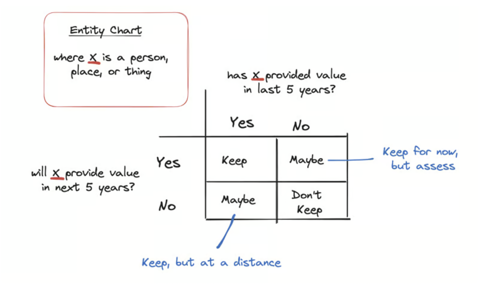

I'm in the process of making my first voluntary move. I've learned so many life lessons while living in Tampa, through my own set of experiences, and the wisdom of others who are further along in my timeline

I have spoken recently to someone half my age who had a really good piece of insight when moving. I have a lot of things - items of possession - that I wish to get rid of to live a lifestyle that is more true to me

He said what to determine what to keep and what not to keep, ask yourself the following questions

- Has this item provided value in the last 5 years?
- Will this item provide value in the next 5 years?

I thought about this for a moment - and it can be abstracted out a bit further. Instead of items, think of entities

Where an entity is a people, place, or thing

I've had to make some of the most brutally hard decisions in my life last year. I've come to realize that what feels good in the moment is not always best for me. And that sometimes the harder, less walked path is the one that will help me be where I want to be. 

These are lessons that apply to making friends - letting go of friends. Starting businesses - letting go of businesses. Starting hobbies - letting go of hobbies. Buying things - getting rid of things. Starting relationships - ending relationships. Creating blog entries - deleting blog entries. Creating identities - letting go of them. Starting new experiences - forgetting old ones. 

Change can be a good thing