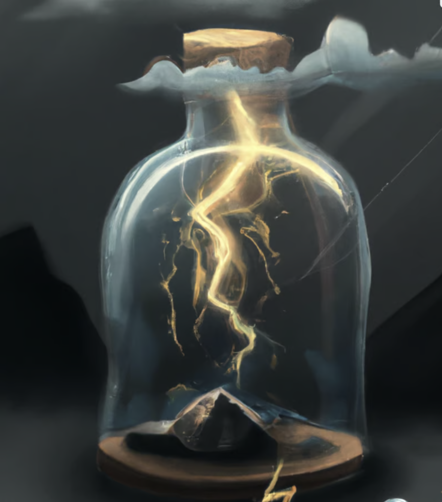
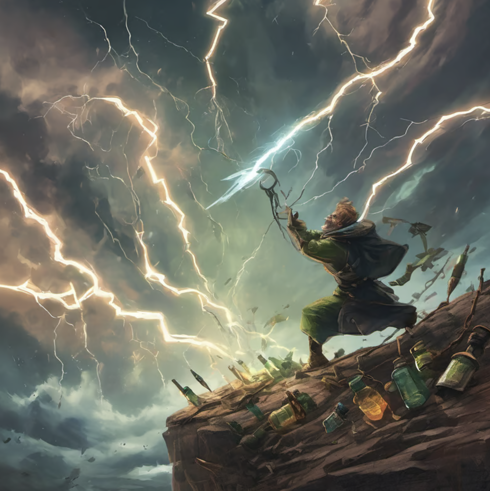

Sometimes I get these surges of inspiration to create something cool, inspirational, or artistic.

They come in a fleeting moment. Sometimes it's after talking to a friend I haven't seen in awhile. Or getting to really know someone after having been acquaintences for years. Or seeing something that just blows my mind away

Sometimes that shock, the clashing of "wow I didn't know this about this person" or "I never thought about things that way" or someone proving me wrong forces a perspective change in my mind.

In those large clashing of mental perspectives, there will come an "aha" moment. In that moment, I will develop an original thought - something that I have not heard anyone say, or described in any way shape or form - and it always come based on the experiences I know from those closest to me and of my own

This isn't to say that thought is completely unique, many other people have thought of the same thing. 

> Through life you will be shared with the wisdom/knowledge of the the "aha" moments of those closest to you. You won't appreciate it as much if you came to it on your own though, but once you arrive to the same conclusions by living similar experiences, you truly appreciate that "aha" knowledge

What I've come to realize is that the more experience you have in a given topic or domain, you will generate more unique "aha" moments. And, the more unique it is, the more powerful it becomes if you capitalize on it.

It's when you really have seen so many "aha" moments in your domain that you realize what is unique and what is not. 

Capturing these "aha" moments is like lightning in a bottle

To have lightning to begin with, you have to be true to yourself, in a sponatenous way. Lightning will come naturally as your life story progresses, from the clashing of ideas and identities of people you meet and things you relate to

To capture lightning, you have to be able to recognize it. This is only through experience and seeing enough "aha" moments in the domain you care about

Once you have it, you can do wield it to do crazy stuff with it. You can use it to build creative works of art, build businesses, start meaningful relationships with people, invent new products, build strong communities, etc. 

> People who have good taste in music, design, etc have a lot of experiences in their domain to recognize what is good production quality and what is not. It is subjective though, but there are clear differentiators between mediocre and bad quality though. E.g., design should follow well established design principles, music production should follow music theory, etc. You can really only break these theories, these principles, if you intently know why you are breaking them

> Bottles of lightning do expire over time. If you don't act on it chances are you won't it in the future and you lose the ability to capture/capitalize on bottles of lightning. They come back with practice though