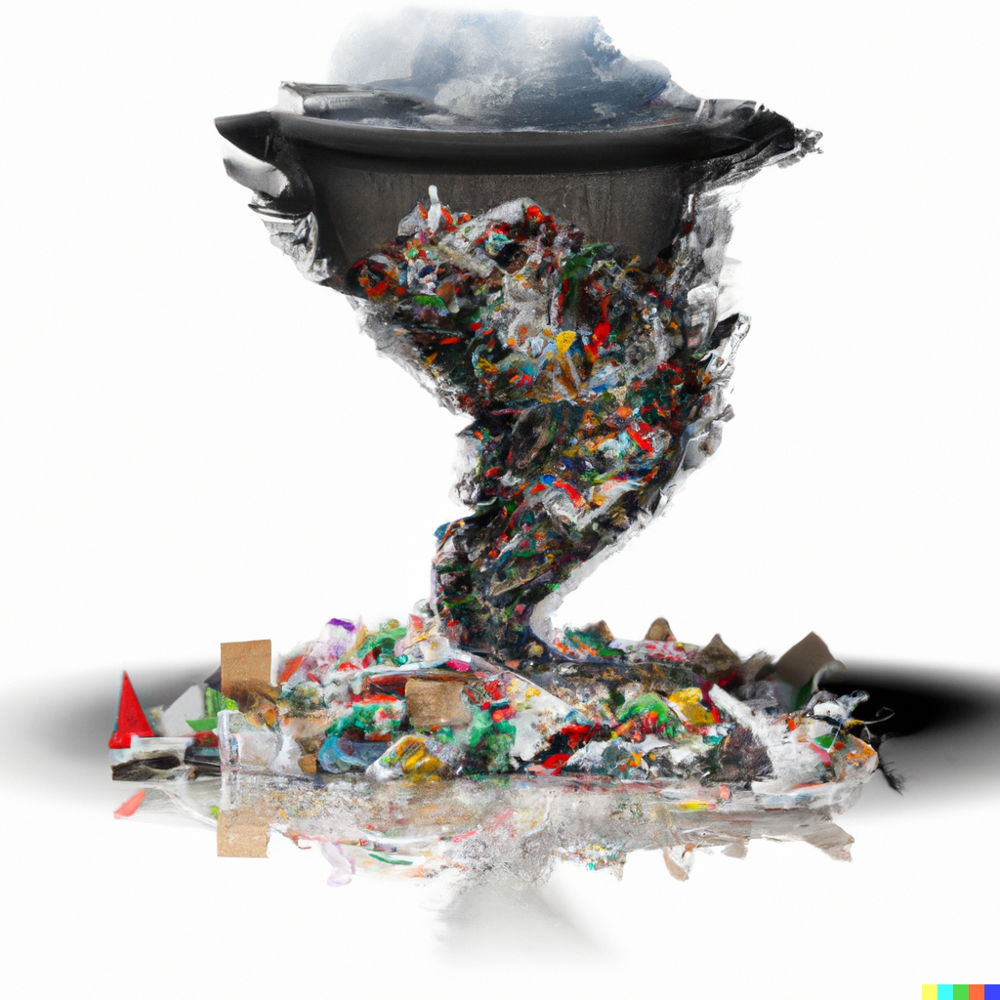

Recently I watched the TV series, "The minimalists - Less is now". It's a show preaching the benefits of minimalism and how we own too much stuff that we don't use

I've thought about my own life, and all the things that I own. There is so many things that have been influenced by my desire to try new things, new hobbies, and things I wish to learn

Now I'm in a moving process. Having to go through all the things has made me realize how costly they are. From a mental standpoint of remembering where I stashed said items, to the cost of moving and organizing it, to the physical monetary cost and space storage cost

I have also realized why I buy certain things

Some of what I purchase at times comes in not knowing what my preferences in products are. I think knowing what my preferences long term is invaluable, especially if the cost of goods is low. For example, preference in pens, sticky notes, etc.

Sometimes I will buy things as reference level material. I will buy many manuals in many different topics of domains - from software topics, to how to start a nonprofit, to cooking. I will usually get 2-3 books on that topic but won't be sure whether the content will actually be useful to me. Many times I'll skim a book only to find out everything I wanted to know. This is still valuable information to me regardless, but now I have a book I don't have a use for

Sometimes I will buy things in the form of an impulsive purchase, based on marketing hype. I have constrained myself to wait a day before buying something as a habit

Sometimes I will buy things as a form of curiosity. Many times this will come in video games, where I'd like to experience the creation of a world, or the manufacturing and design of a new product idea. This will usually provide inspiration for future ideas, or allow me to experiment on new product ideas temporarily. Example - ice cream machine to test run recipe ideas I have

Sometimes, I will buy things as a form of overpreparation. This has saved me from having to think about needing toilet paper during Covid, but I also have way too much rice 
I need to dump out during a move. It is much like pre-optimizing things like over-engineering. It's also buying tools I think I might need but don't actually use. Now I lean towards using hackerspaces, the gym more, etc where equipment is shared

It isn't just things that I buy either. Sometimes, it is photos, videos, free T-shirts I have been given, etc. I have become more intentful on having less of the same given type of item, such that each remaining item becomes more valuable. This means culling my T-shirt and hat collection

It is also people in my life too. I have been making an intent in having less people in my life, but of higher quality connection. This means I don't keep up with as many people, and I re-evaluate what each person brings to my life

It is also all the software apps and features on my phone. I have downgraded to a basic Iphone 8, and it's made me aware of how little I actually need. I don't need many apps, I barely use social media as well

Each time I cut something out of my life, I am saying "no" and making room for more "yes"s to things I care about
