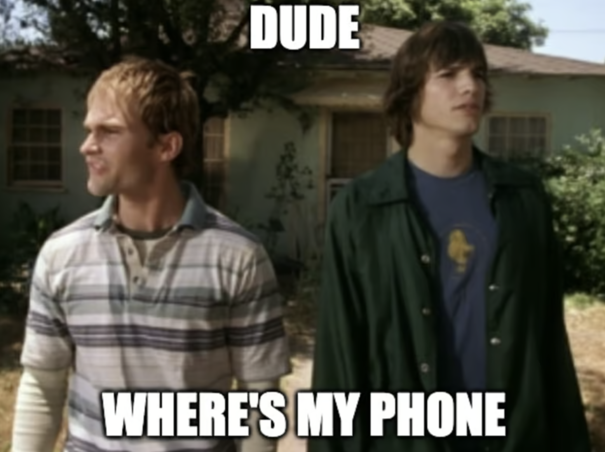
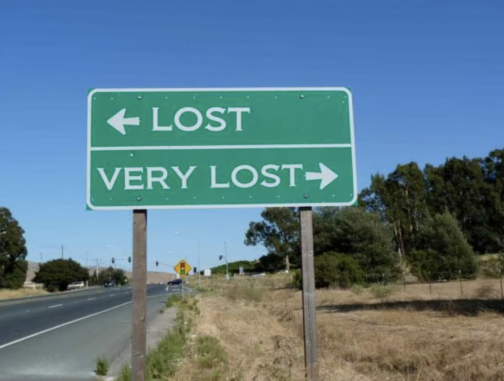
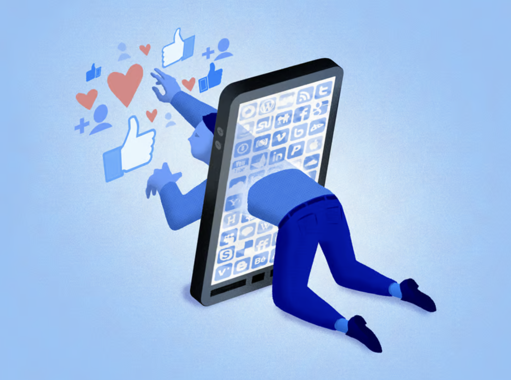
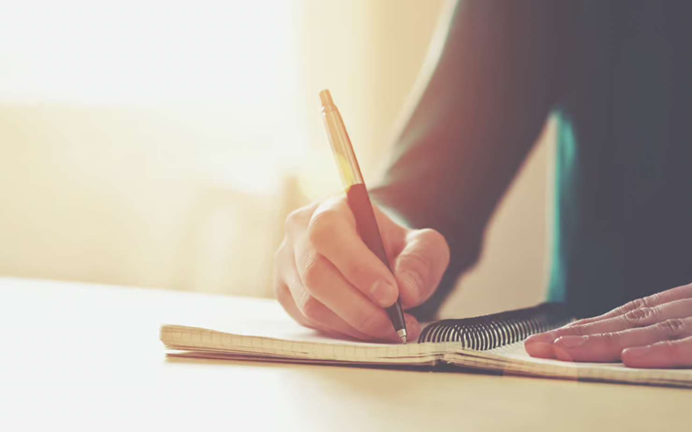
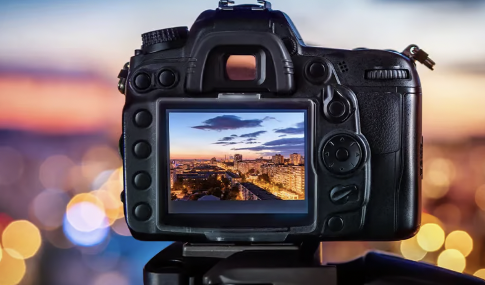
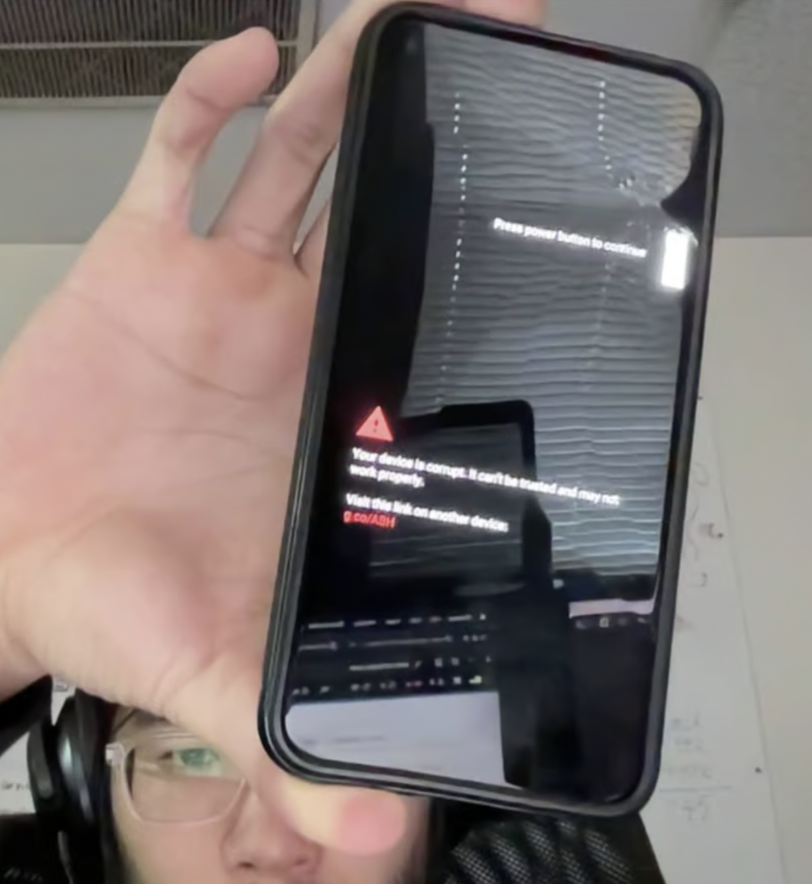

A few months back, I decided to run a personal experiment

How much do I rely on my phone in my day-to-day life?

This was a part of a philosophy of [embracing minimalism](https://www.vincentntang.com/embracing-minimalism/). I wanted to go back to the old days of doing things. The days before chatGpt existed. The days when AoL and dialup noises were a thing

I always considered myself a phone minimalist. I barely have any apps installed on there. I disabled almost every notification especially social media apps. I like keeping my dopamine levels very low, so even the seemingly boring things are exciting which usually inspires my best creative work

Basically I wanted my phone to work for me, not against me. I wanted to have full control over what it did and didn't do. 

To do so, I wrote a list of everything I use my android phone for, on a day to day basis. Here's that list:

- GPS
- Spotify
- Internet/web surfing
- Social Media
- Texting/calling
- Journaling
- Calendar management
- Alarm
- Camera/photo gallery

I was quite surprised how long this list is considering I feel I barely use my phone to begin with

## GPS

I completely replaced using a GPS with absolutely nothing. I only used GPS whenever I really didn't know how to get to a location

In many trips, I would get absolutely lost. I remember trying to get to the climbing gym and taking a wrong turn, only to spend an hour instead of 15 minutes to get to my destination. 
It really cemented how little I knew of my local area in the 4 years I lived there, the road systems, and how much I relied on GPS to navigate

Much of it I felt is I didn't have the brain capacity to remember these things, because I simply didn't need to

It forced me to rememeber major landmarks, relative positions, and how to navigate cardinal directions using the sun. 

I don't use GPS as much anymore. It just seems redundant if I know how to get to my destination, and it does inspire a bit more confidence in my navigational abilities

**It's made me appreciate the feeling of sponatenity and getting lost, and trust in my own problem solving abilities**

## Music player

There are days where I don't listen to anything and just sit in pure silence while driving. To some it sounds weird, and uncomfortable, but it has really helped act as a form of self-meditative reflection while driving.

There are phases where I listen to music and other times that I don't. This applies to going to the gym, doing housechores, etc - to me I learn to enjoy both sides of the equation.

**It's made me appreciate dead silence and my own thought process**

## Internet/web surfing

I'm a really avid reader of Hackernews, and I like to know about the latest game/movie/tv series that come out.

Not knowing anything about anything just felt weird. It felt a bit disjointed. It felt like FOMO, fear of missing out. This was also a time where I sold my TV and barely used youtube either. It felt so uncomfortable not having any form of escapism and accepting the uncomfortable reality of the moving process I was in.

**It's made me appreciate what escapism offers to numb difficult times**

## Social Media

There was a phase in my life many years ago where I didn't have social media. There was a phase where I also used too much of it as well and couldn't stop posting everything everywhere all the time. Usually videos of my cat doing dumb things and cool stuff I was doing in my life

Originally, I only opted using social media when I got tired of keeping up with too many people individually. Sending pictures of places I went to via text message didn't scale well. Making stories, post, one time all in one shot asynchronously was so enticing to me. It became a tool that helped connect me to things that mattered

When you go on IG, you roll the dice on what you see on the homepage based on IG's algorithm. It feels a bit weird that I'm allowing IG to tell me what it wants to see, and not having fine tuned controls to opt out of it. FB messenger doesn't really have this issue, snapchat is too edgy for me, and I prefer youtube shorts over tiktok since I still get creative ideas from it

When I deleted everything, things felt nice. 

**It made me appreciate the present, the every day, the now. 
It's made me learn to appreciate self-validation more, and not needing it externally**

## Texting/calling

For about a whole month this year, I decided not to reach out to anyone. No social media. Nothing. 

It sounds a bit crazy, but it made me aware of how much influence different people had on my life. Especially those closest to me. I realized as well some of my relationships may have been something I needed in my life at some point, but now not as much.

Some might call it the silent treatment, but the reality was it was just a long set of self-reflection. People would reach out, and it was really nice when I didn't have to plan my going away party either

**It's made me appreciate the influence others have on my life, and the gratitude I have for having them**

## Journaling

Most of my writing thought process is really honed everyday because I journal quite frequently

At some point, I downgraded to an old iPhone8, which is end of life as it's 8 years old. Standard practice for Apple is to release breaking changes that slow/kill off old devices to the point you want to buy a new one

Journaling with an immense amount of typing lag and typos felt weird. Everything I typed, had a literal time cost to it. The amount of things I could write was halved or even less.

I could not write thoughts, theories, things I wanted to reflect. I had to jot down half baked notes, and it became a sense of constant frustration for me.

**It made me appreciate how much I take technology for granted.**

> There was a time where writing wasn't even a thing. Where paper/pens didn't exist. You just had to remember, and it's so hard to keep track of so many things in modern day society now adays

## Calendar management

This one is a bit harder to define. I keep a lot of recurring events of places of interest to me. Like there's a standup comedy event every thursday but I never go

Cleaning up my calendar and have nothing on days felt nice. No agenda. Things could be sponatenous

Moving to a really crappy phone made me realize I don't really need a calendar most times. I only look at it during the work week. I don't need everything planned by the hour

**It's made me appreciate not having a plan. I don't need to ask what's next, that's an american thing**

## Alarms

There are two alarms I rely on. Meeting alarms, and a wakeup alarm. I do not rely on notifications, rather just a pure ringer sound

Not having any sort of alarm for a bit when I changed phones was weird. It felt like I lost all sense of time control in the work day, I had to physically look at the clock on the wall. I had to mentally remember the meeting coming up. 

My morning alarm I completely replaced with a physical alarm. And I turned off my phone, such that I couldn't use it anymore. I became less reliant overall on it

**It's made me appreciate the sense of time control a phone brings, if done right.**

## Camera / Photo Gallery

I almost forgot about this one on the list. It's easy to take for granted we have a camera with us on all times, and a photo gallery to go through years of history

There were days during this experiment where I simply did not bring my phone with me. Sometimes it was a 15 minute drive that ended up an hour to the climbing gym

Followed by a solo date night at the revolving sushi restaurant which required a text reservation

No phone meant no text reservation. People thought I was weird, but I was able to just set up an appointment by just talking to the staff instead. 

There was a time where I really wanted to capture the moment in a VR event I went too after, but alas I didn't have my phone. I would just have to physically remember the experience instead, and it really cemented how much I rely on my phone to capture memories

Someone once told me that you are either taking pictures or really enjoying the moment, and not both. It's sometimes hard to find a balance, because anticipating what pictures you will take (to either share or not) ruins the moment 

**It's made me appreciate the ability to remember things without pictures**

## Closing thoughts

I downgraded my old pixel5 to an iPhone 8 after my android phone broke.

Going through this experiment has made me realize how much I actually use a phone for

I still use it for the list of 9 things:

- GPS
- Spotify
- Internet/web surfing
- Social Media
- Texting/calling
- Journalling
- Calendar management
- Alarm
- Camera/photo gallery

but I use all of the features now, a lot less. And only by more of a needs basis instead of a wants-basis

I feel that as technology gets better over time, we will all just be a little dumber, and forget what it means to navigate using the sun and stars, or appreciate dead silence amongst other things

Don't worry though, we can all be prompt engineers and rely on our AI overlords 😉

> There's always a common misconception about me that people assume I'm really into tech, because I ran a tech group. I only think of tech as a tool to get things done; I always defer to my sticky note addiction
