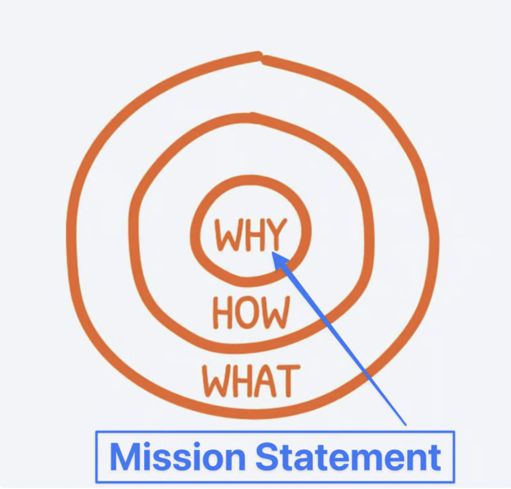

<!-- DALLE - a ship sailing into the ocean towards an  exponential learning curve, the great wave off kanagawa style  -->

Recently I met some interesting people, who provided some unique perspectives on life

This time I interviewed a former national guard commander who is breaking into tech, as a software developer. He had many good pieces of advice, some of which I written down on [use colors on your resume](https://www.vincentntang.com/use-colors-resume/).

Here are the most important lessons you can learn about breaking into any industry (coding, engineering, etc) rapidly from a former commander

## Have a clear objective

Military commander culture is a very niche culture. It is a culture ruled by self-discipline, tenacity, and self-sacrifice

The best example explaining this culture on the web with this is probably through [Jocko Willink](https://www.amazon.com/Discipline-Equals-Freedom-Field-Manual/dp/1250156947) who covers this topic extensively

With commander culture, everything you do revolves around a mission statement

In this case, it could be "hey I am going to form a new army guard unit of volunteers in this new city", or "I will learn how to scale highly available infrastructure"

Everything you do revolves around this statement. If something doesn't align with these values, you do not spend too much time on it, effectively saying "no"

Commanders generally start from "top down" approach, where all effort into the goal start by asking "why?"

This is pretty similar to Simon Sineks thought process on the [golden circle](https://simonsinek.com/golden-circle/) where "why" is the mission statement

After you figure your top down approach, everything becomes how can you figure out the "what", the "bottoms up" approach to solve everything inbetween

In this case, if you are learning to build "highly scalable architecture" -> you would need to know concepts like Docker, AWS, Kubernetes, etc, these are the "whats"

The "how" - how it all glues together is what experience and talking to professionals in industry comes into play. It's hard to determine of all the opinions on the web, which combination of tools is actually used most predominantly in industry from a cost savings perspective?

The "how" usually gets cemented overtime by going into different communities with knowledgeable experts that can help piece together things faster for you

> When I first started my career, I had adopted this principle unknowingly. Instead of asking "How can I build highly available architecture at big companies", the question I asked instead was "How can I be the most qualified entry level engineer in the shortest time possible", since I needed a job. The answer to this for me at the time was [hackathons](https://www.vincentntang.com/how-hackathons-got-me-a-job/), learning in public, and dev communities

> Not having to worry about anything holding you down in life (e.g. looking for a job for money right away) means you can be truly creative in figuring out the best "how" to get to where you need to be, since you aren't on an external based timeline

## No excuses

With the mission statement defined, you don't give into excuses

Nobody is in charge of your goal except you. You are your own set of accountability, and exercising self-discipline is the way to get there. Relying on external motivation only leads to long term problems

This isn't to say you should do things alone either. There is a fine line between knowing what you don't know, and being vulnerable so others can help you along the way

In this culture perspective, you think of the end goal in mind - all the time. It is your vision, your "why", your end state that helps you make hard decisions easier to vet

If your objective is learning how to scale "highly availabe architecture", you can apply the idea of [1% continous learning](https://jamesclear.com/continuous-improvement), where learning becomes compounded over time. Another idea as well is [space repetition learning]. Learning becomes exponential and you get to where your goal is faster than most people.

> As a side note, having a strong mission statement is a double edged sword. You make a lot of sacrifices along the way, and things no longer become about the journey, rather the destination. Ask yourself if this is a time-sacrifice you are willing to make - e.g. taking higher risks when your young

> When you reach your goal, you will ask yourself ["whats next"](https://www.vincentntang.com/how-it-feels-retiring/) because you spent so much time laser focused on one thing and forgot about everything else

> These goals need to be moderated in short term bursts, with vacation downtimes inbetween where that goal is not worked on. 

## Use ChatGPT to enhance empircal learning

ChatGPT is predominantly seen as a tool to automate the creation of writing prompts. I've used it to write a number of business cases, email blasts, etc when I used to run a nonprofit organization. For coding, this was predominantly creating unit tests for code I had

ChatGPT is trained on a large swath of models on the web. Before ChatGPT was around, I used to learn a lot reading through reddit threads. This was to learn about different industries as a whole, develop a wider perspective of different viewpoints, and questions that I wanted answers to

Other times I would read blogs and books of authors I was interested in

The time it takes to sift through this information though, has a cost. With ChatGPT you can reduce the feedback cycle and essentially have a mentor of sorts, for learning new material in engineering etc. 

This is to supplement the basis of processing the "how" in the "why how what" model

> Using ChatGPT for non-empirical based learning (e.g. emotional based self help) is not a good idea. It's also a good time to cross-check the information you get as well

> Don't use ChatGPT to write bulletpoints on a resume, it's only as smart as the context you put in

## Teach what you know

"Commander culture" is predominantly two seperate functions.
It is "your mission statement" as well as the "wellbeing of others" in your stead

- Your mission ("e.g. how can I scale highly available infrastructure")
- Wellbeing of others in your stead 

The first bulletpoint I covered fairly extensively

The second bulletpoint can be ascribed by this - learning is best done when you learn from someone above you, at your level, and below you all at the same time

This means ["teach what you know"](https://effectiviology.com/protege-effect-learn-by-teaching/) in the instance of "wellbeing of others" from this culture.

By ascribing to this methodology, you can fill in the gaps of the "how" you don't fully comprehend

One way to teach what you know is by [learning in public](https://www.swyx.io/learn-in-public) - giving public talks at meetups, doing youtube tutorials, etc

