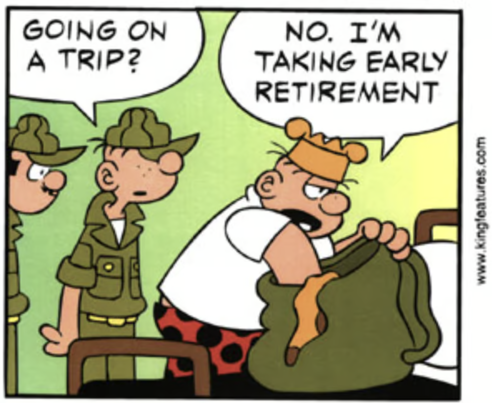

When I made the decision to vacate my lease in Tampa, all my close friends had asked ["what's next"](https://www.vincentntang.com/how-it-feels-retiring/).

Some part of me didn't want to prescribe any notion of where I might go. The ones closest to me see me as a guiding inspiration to their life and can't see me as anything but that. I need inspiration too - and I am looking inward this time. I need time to reflect, to understand myself better, so I can start afresh anew as a blank canvas in a new city

There is this philosophy that instead of saying "no" to someone, you can simply say ["maybe"](https://www.huffingtonpost.co.uk/entry/embrace-the-power-of-maybe_uk_5c87ab1ee4b0d936162be69e). It is a softer nicer way of saying "no", one that doesn't cause a lot of friction between conversations. Sometimes it's an easier halfway point than simply going "yes" all the time to saying "no"

For example, if someone asks what my plans are, originally I stated I didn't have any, aka "no". This would lead to sometimes really uncomfortable conversations as they don't know how to follow up with it.

From their point of view, I have always stated what my plans are, where I am going, and now I am not

It is a shock for sure. In the beginning I was okay doing this, but I also didn't want to deal with uncomfortable situations all the time. This goes into ["Choose your battles"](https://personalexcellence.co/blog/choose-your-battles/) philosophy, and I simply didn't have the energy to go against the grain all the time

I don't want to completely abandon my circles either, but I am choosing wisely through [embracing minimalism](https://www.vincentntang.com/embracing-minimalism/)

Now I simply state where I will be the next. This will be in Texas for work function. It's a city, a concrete location I have to be anyways, and it answers the question of "where is Vincent going next"?

But it is okay to share your short term goal.

No one but me needs to know my long term goals at this moment. There is some sense of comfort knowing the place I chose was of my own accord, and not because someone told me I should go

> Be mindful of sharing long term plans though. This is to prevent a [false sense of achievement](https://medium.com/@nunopadovani/the-false-sense-of-achievement-344bd36b1e6e). Instead of specifically stating where you might go, you can just state a finite number of paths you may take. "It will be most likely be one of these 7 cities, here they are from west to east coast"

> Time will reveal itself over time, when I feel more concrete about my own plans (they change pretty frequently anyways)

> You can instead ask "got any recommendations?" -> It is always interesting to see where people think I might live, based on how well they know me

> There are many ways to say no, and it can also be very gradual over a long time span too. No need to burn bridges