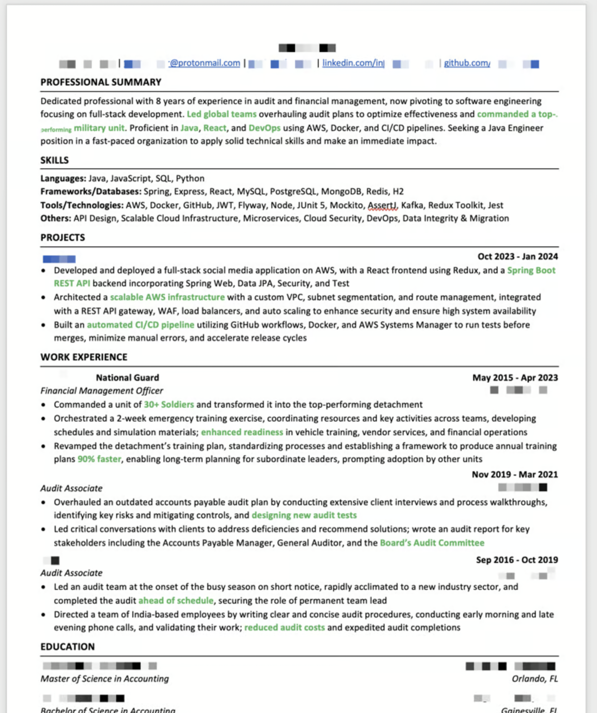
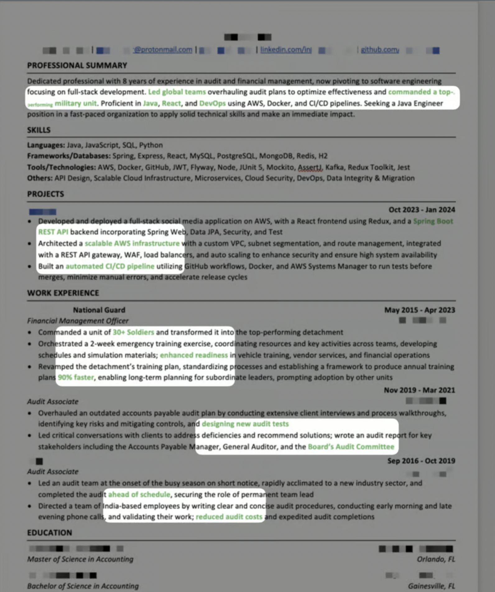

Just recently, I posted a job referral at the software development company I work for, since we were hiring. One of many resumes I had came from Orlando Devs, and his resume really caught my eye despite the fact I've read [thousands of resumes](https://www.vincentntang.com/writing-resumes-lessons/) in my lifetime

Here is that resume:

Instead of explaining why this resume format works, I will demonstrate it. I've blurred out the non-colored sections 
 

At a very high level, you are able to see the following:

- He commanded a unit of 30+ people
- His prior history is in accounting
- He knows how to architect highly available systems and how to code in popular languages

It is the story of his career, in just 3 bulletpoints, but you can grok it in less than a few seconds. The top level summary also describes it in words, but this time who he is, what his skills are, and what he is seeking

It's a very well written resume that gets the point across quick, and aids into a good first impression that this guy knows how to communicate fast and well

By providing an additional channel of communication (e.g. visual grokking of colors), you are providing the reader to skim and peruse the story in the way they want.
