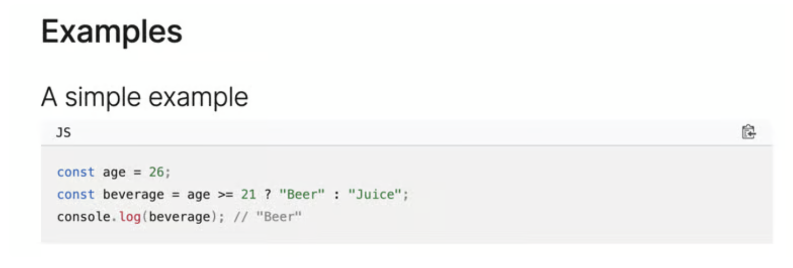

<!-- Guilin, China -->

Often times I have gone through bouts of life that are uncomfortable, difficult, and hard to process

This is currently the cycle now. I am in a moving process. Moving is incredibly uncomfortable. I have to part ways with things I've had for years. 

Things like sentimental items that no longer serve the current me. Things like an old desk that I've had written so many blogs and software programs on. Things like a couch that I've slept on and stayed overnight binge watching a netflix series. Things like books I've read but am no longer interested in. 

These things vary vastly in nature. It is also the environments, the city I am leaving, the familiaritiy of comforts that I am parting ways with too

Everytime I get shed something familiar, a part of me feels lost in the moment. It feels like a punch to the gut. Bittersweet almost. It feels sad in the sense of mourning the loss of something I spent so much time with. But great because I am freeing mental space for things I care about in the future

Over the years I've dealt with a lot of hardships. Most of which aren't as relatable as moving and had to process solo. With each hardship I've developed some methodologies to ground myself. To maintain a neutral sense of being as life pulls me in different directions

These are what they are:

## Going through works of my creation

I create a lot of things. Capturing pictures of eventful times in my life, blog entries I write, private journals, software programs I've coded, physical things I made at a hackerspace, etc.

Each thing I create is a snapshot of my life, revolving around the thought of [catching lightning](https://www.vincentntang.com/lightning-in-a-bottle/). It is the creation of many ideas coming to fruitition. The best parts of me even in the harshest of times

It's a reminder of how far I've come in life. From ground zero to everything I've built up until now

I can see how much I've matured. How much my writing style has evolved, and become more confident in myself. Since I started writing [7 years ago](https://www.vincentntang.com/2017-into-2018/). I can see how I express myself freely regardless of what others may think

I can see the past challenges I've overcome, both professional and personal. I can see the start of my career when I first wrote this coding example 7 years ago on [MDN](https://developer.mozilla.org/en-US/docs/Web/JavaScript/Reference/Operators/Conditional_operator)

I can see pictures of my past self when I was still new to everything. How many crazy adventures I've had up until this point that were just spur of the moment

Seeing what I've done in the past has always been an inspiration for my future. Nothing inspires me more than myself. And I always look inward instead of outward for validation first

## Hobbies

I have a lot of hobbies. I don't call myself a hobbyist though; I am just interested in many things. I learn without boundaries, and this includes trying things I might be interested in. My philosophy is if I like it once I'll try it twice or more

However, depending on where I am in life, I embrace a different hobby

If I am feeling constrained, I will do dancing. If I am feeling overwhelmed, I play video games. If I am feeling reflective, I will journal. If I am feeling disconnected, I will climb

There are many more examples of this, but these are just to name a few. I don't have prescribe to any sort of center stage ideology or sport. These phases of me are all still me at the core

Blogging and journaling is my mostly go-to way of setting myself neutrally though

## Going for walks

Going for walks is something I've never really cared about until recently

They say you get old when you spend more time reflecting than doing things. Maybe this is me right now to a degree

I love going for walks. There is something about being in control of where you walk that is satisfying. Sometimes in a new area or on a call with a friend. 

Running goes into the same field as well

To me it is a form of meditation. A time to embrace the present, and not time travel to the past or future