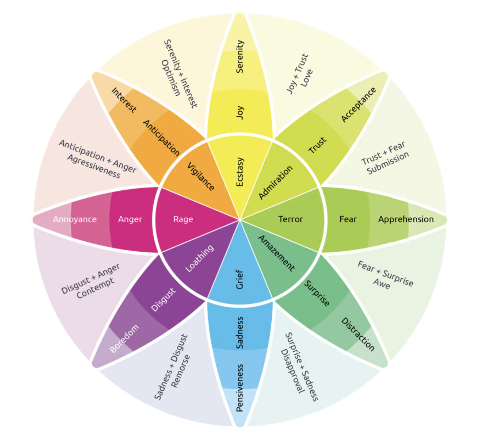
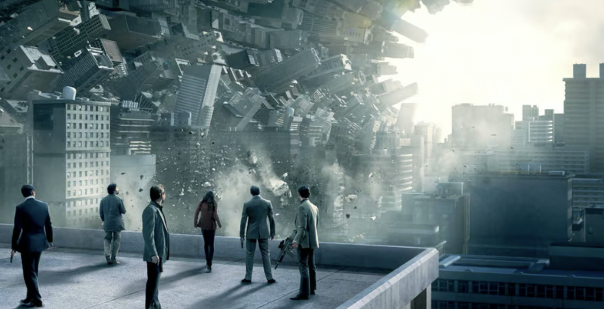

<!-- construction workers building a cloud of dreams, van goh style -->

Lately, I have been having a lot of dreams

They usually come during an extreme phase of change, aka [catching lightning](https://www.vincentntang.com/lightning-in-a-bottle/). Where I am unable to process a large swath things happening in my local environment. 

They could be from very extreme cases of culture clash that almost seem contradictory to each other.

In the past, I used to write down what those dreams were. I don't as much anymore

I've talked to many people as well during my lifetime about their thoughts on dreams too. Some people simply don't have dreams, others believe in lucid dreaming, etc. 

These are just some studies and theoretical conclusions I have made

> Note: This is all self study and ancedotal, I am not trained in this field, but I do have an interest in a lot of self studies and psychology. I do not read papers on this topic. That being said my take on things may be very different. 

## Insightful dreams and emotional wheels

Dreams are triggered predominantly based on a large series of emotions changes - normally by the polar opposite, especially among empaths whom are most affected by them

In psychology, there is something known as an "emotion wheel". Different psychologist write their wheels differently, but they more or less look very similar

Here is what one looks like

Different cultures (cities) tend to evoke different defaults on the emotional wheel. 

To give an example, I am from Orlando

People they are predomintly happy. If someone were to experience a large sense of sadness where this is not the norm, a very polarizing emotion, this would more than likely trigger a dream

For someone that isn't accustomed to a lot of fear, and then experiencing a serious dosage of it, this will trigger a dream as well

Vice versa in the case of someone not used to experiencing a lot of happiness, and then experiencing a lot of it

> I am not differentiating dreams and nightmares here. To me the definition of a dream is the vivid construction of an environment that is played out during sleep

It is usually the drainage of one emotion, the fillment of the opposite emotion, that triggers the most polarizing dreams. This could occur over a day, or over a month, but usually at least two climatical polarizing experiences through that timespan will trigger it

When those dream states do happen, there are a few general rules that happen

Here is what they are

- First, things that are familiar will be constructed
- Second, things that are unable to be processed will be constructed

This varies between person to person in "what is familiar"

Empaths will construct a scene first. If you move cities, the scene will be based around something you are familiar with in the previous city

In this case, I am from Tampa, pirate ships could be one example

The unfamiliar territory then may become the people, because this is what I am trying to get accustomed to again. Even though I am from Orlando originally

When you process the dream after the fact, the unfamiliar territory will tell you a story. You can compare it against the archive of stories, life events in your life, symbolic meanings you are familiar with - to get a perspective of what the dream is telling you

It could be labelling and identifying something you couldn't find the words for. I call these "insightful dreams"

This isn't the only type of dream as well. There is another one that is less drawn to changes of larger changes of emotions, and more based on fantasy

These are what I call "creative dreams"

## Creative dreams

For some that I've talked to, some dreams are not about trying to understand something, because their worldview is concrete and understood. They know what they like and don't like, and don't feel the need to explore

Sometimes in cases like these, dreams tend to be more creative in nature. Where something is not to be understood, but rather a goal to be created, or something to be entertained

These dreams tend to fade very quickly though, and harder to capture on paper after waking up. Because they aren't triggered by large emotional changes over a large time span. And they are usually triggered by movies and entertainment media more than anything, e.g. more fantasy based

I have experienced this at really random points in my life. It is usually fantasy novels, movie scripts, etc that play out in my head during these phases - and they are usually variations of stories I hadn't seen.

## Conclusion

I probably won't write more on this topic, but it is something that I've thought about writing for years though. I'm jotting down my notations of what my own dream types and construction methods are though, based on my own psychological research of my subconcious

Having been my own point of inspiration for many things in my life, my subconcious dreams usually tells me a story, where the goal is a piece of wisdom or insight that I hadn't realized yet. 

When things are comfortable though and I go watch a lot of different TV series - it tends to be more creative, there is no goal it tends to be more entertainment-based

There are sometimes a mixed set of dreams that are based on fantasy (movies I've seen, fantasy novels I've read) combined with things in reality. Those are a bit harder to explain since there isn't a set constant in those dreams

> Other theories: there is a really interesting book called [thinking fast and slow](https://www.amazon.com/Thinking-Fast-Slow-Daniel-Kahneman/dp/0374533555) as well. 

> The synoposis of this book is this. There are two modes of thoughts - Type 1 and Type 2. Type 1 is more based on intuitive natural responses due to social conditioning, Type 2 occurs due to slower thinking in processing something less familiar. Such as learning a new concept in engineering

> When Type 2 assimiliates into Type 1 in a rapid pace, dreams tend to happen for me at least