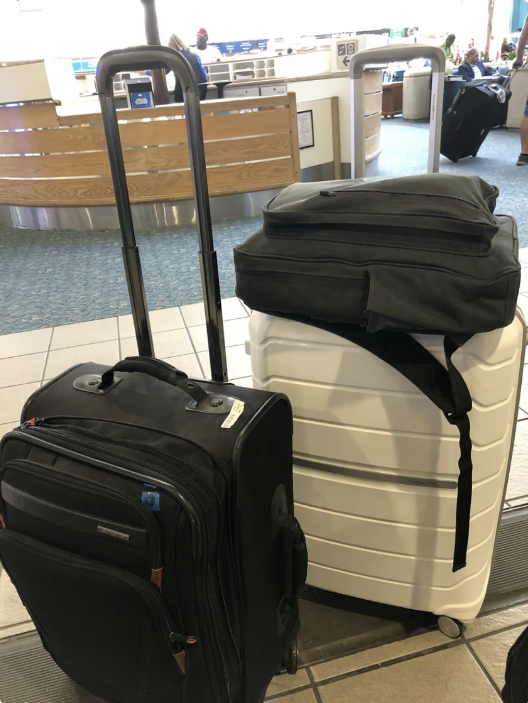

__leaving florida__

I just moved out of my home state for the first time in my life. Not for work, visiting a friend, or to travel on vacation. But rather as a voluntarily choice to choose somewhere else to live. And to understand and explore myself better.

I have been thinking about my times growing up. My childhood is not exactly normal - it is tangential and polarizing. The most notable influence is that my parents ran their own business growing up. And all that is talked about is work 7 days a week

It takes a toll on you mentally. Business becomes an attachment of struggle. You learn to shield yourself mentally to develop any sense of emotional wellbeing. Both for yourself and everyone around you. As you become the adult and emotional caretaker for others. The caretaker identity becomes a burden of responsibility

And in living that identity, you also develop polarizing views - on just about everything. The world seems gray. There is no black and white. Everyone can be right and wrong at the same time

This means it's hard to take a stance on just about anything. Politics, policies, etc. Who is right or wrong in a situation. What is morally correct and what is not. You learn to question everything, not knowing what to believe in

It is like walking on a tight rope, where one side is one common viewpoint, the other is another. These viewpoints are on opposite sides of the spectrum. 

To give some ancedotes from my personal life about polarizing viewpoints from my life:

I would listen to business struggles from family, and in the same day struggles from friends living paycheck to check. I would be seen as a spoiled kid but feel that I lived a poor third world country mentality. I would have many friends anonymously online, but not many in real life - as I was socially awkward

Living multiple viewpoints growing up, meant I developed multiple identities I related to too. It would be hard to process many things happening at a time, because everything was everywhere all at once

To combat this, I would take journalling to make sense of the world. Have outlets like video games or hobbies as an escapism vacation. 

Many times I would take to journalling as a neutral ground medium to process my own thoughts

But other times I would look outside the circle I was in. I would look for inspiration elsewhere. Someone who could mentor me indirectly, usually someone I understood based on the life they've lived

This meant I never got inspiration from any celebrities growing up. No favorite movies. The inspiration I got, were just people around me living their own life

I would learn to develop a better sense of who I wanted to be, based on the quality and traits of those I liked

And in this process, I would **adopt a mentor** from afar. 

To me, it was monkey see, monkey do. To me, I would see wisdom from all walks of life - including those younger than me. To me, ideas came from everywhere and I'd **learn without boundaries**

And as life progressed, I would solicit this mentorship directly. Sometimes in email, sometimes in person, sometimes in text, etc.

Mentorship always starts first and foremost, from the mentee. The willingness to learn, to ask for help, and to recognize your own pitfalls 

> You can adopt a mentor from anyone. Watching interviews of the person you aspire to. Being vulnerable and asking for help to those you feel safe around and trust in their knowledge/wisdom you seek.

> It is best to have mentors in areas you are weakest in, or weren't exposed to growing up

> If you have no grandparents, consider adopting one - they have lived many lifes with many stories to tell

> You will also have to drop mentors from your life at some point, as you outgrow them in your own unique way. People are there for different phases of your life. It is okay to say no and move on

> You can be the mentor to help others see the other perspective they seek in life, if you've lived both sides.