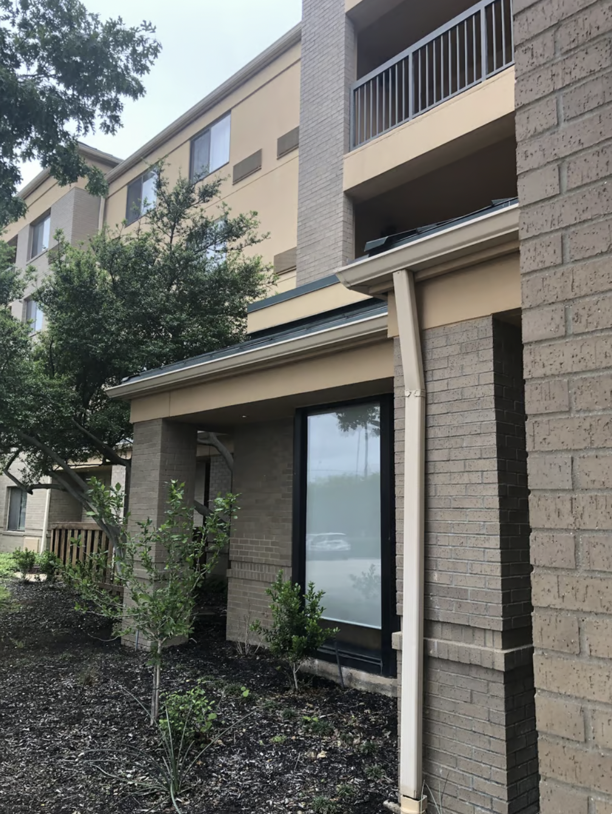

Brown is an interesting color for design. It is normally not a designer's first choice in color design. 

This is because it is very neutral in nature. By default, there are already two other colors you can pick that are neutral - white and black. And these are colors that you usually defaulted regardless, because it's incorporate in different shades of a color (e.g. light blue is white+blue, navy is blue + black)

Having so many neutral colors in a pallete, means you are limited in what emotions you can evoke in design. The less colors you use, the better in most cases in design (2-3 colors tends to be the most ideal)

Brown therefore then becomes a color choice superceded by other stronger, vibrant colors such as blue, green, or red. Because it is so neutral in nature, it will be often as a stand in replacement for white or black, such as dark brown (brown+black), or light brown (brown+white).

Brown evokes these emotions, in color design theory:

- comfort, resilience, security

And according to google's definition

- Brown is a warm, grounding, neutral color that provokes a feeling of safety (probably since it's a rich, earthy color). It doesn't stand out much on its own, even though it can be used for entire walls or rooms.

## Dallas - a city of brown design aesthetic

I have been in Dallas, TX for a few days. 

__one of many similar looking buildings in Dallas, TX__

If you look anywhere in Dallas, you will see the color brown incorporated everywhere. It is very much incorporated in the city decor. Even corporate buildings take on this design, the highways are painted brown, things are naturally rusted as brown, and even the use of natural brown materials are used often like bricks. It is a rustic look, it is part of the logos and decor. It is omnipresent

There are only a few places where the color brown is not used in Dallas, namely in new high rises incorporating more metallic/blue designs in downtown

This is very much different than what I am accustomed to in Orlando, FL.

Having been through the backstage areas of Disney many times, you only see beige, or tan used predominantly as a color to not be looked at. It is used in maintenance areas, control rooms, etc

In Orlando, you will not see the color brown across almost any of the city's design aesthetic. It will not even be in the 
city's graffiti. It will not be in the design choices of buildings very frequently. Green, white, and black is much more heavily used instead

## Thoughts on a very brown-color decor

Orlando I have been told is something too much, or too little - for someone not accustomed to it. Here in Dallas, things feel very much neutral, and because it is more neutral it also doesn't feel like a place of creativity either because brown needs to be incorporated in most design choices

The overall stimulation level is not as high, comparatively to Orlando. People here do not seem as curious, and are just content with things as is. In Orlando, most of the polarizing things there are what is seen externally, but here in Dallas they feel more internalized.

These are just my initial impressions though. I have not been here long and only explored north/central Dallas. It is interesting what effect a city's culture, identity, and color decor style has on it's residents. 
