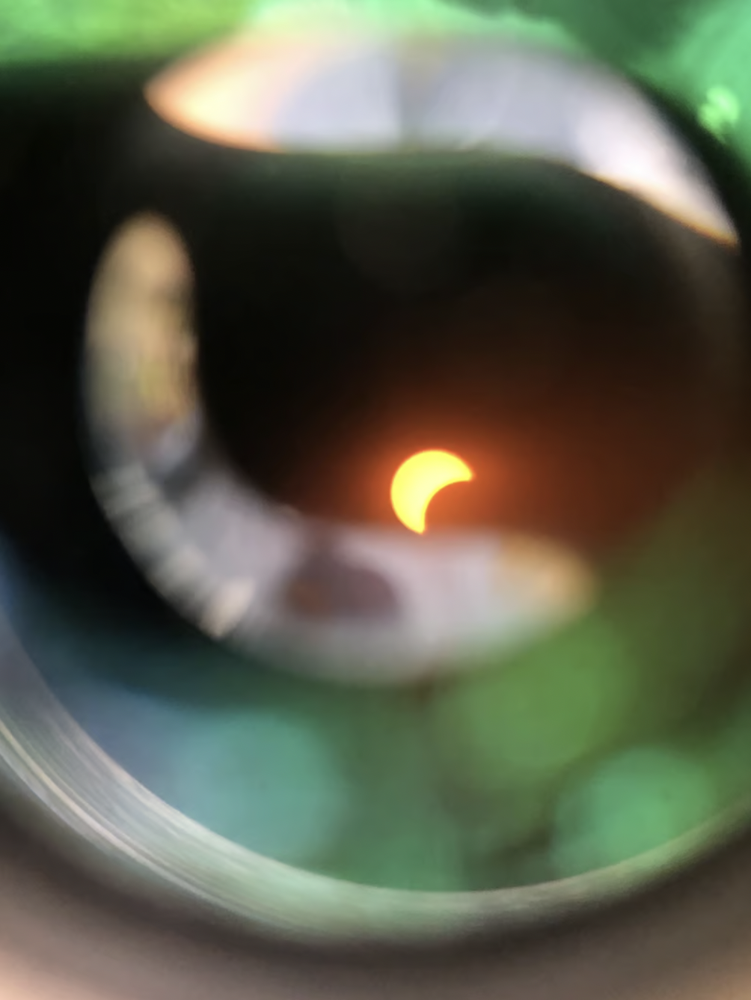
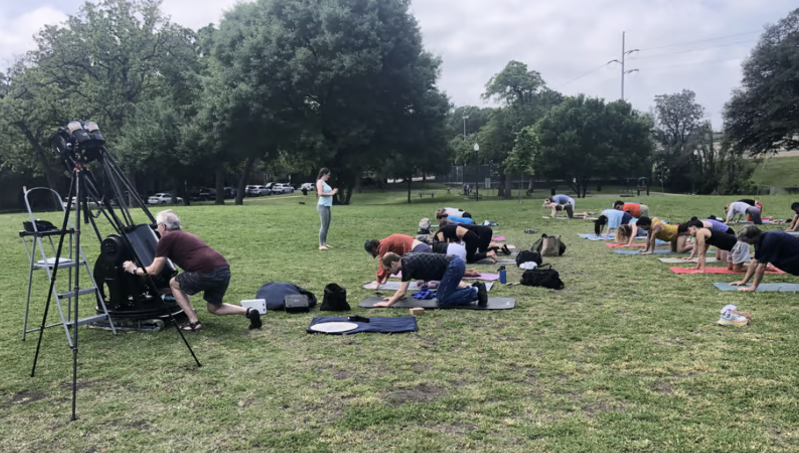
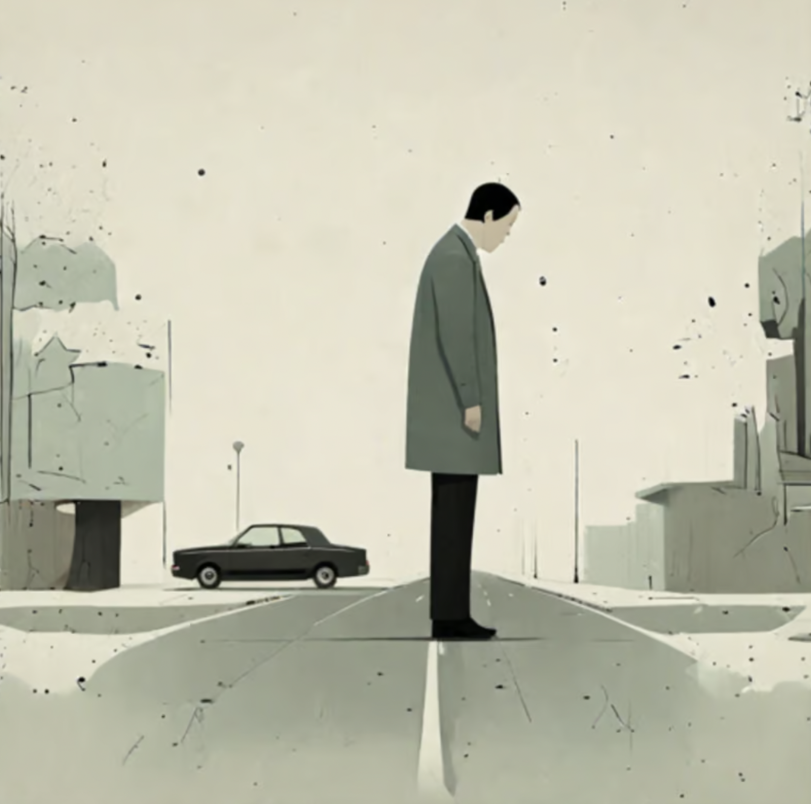
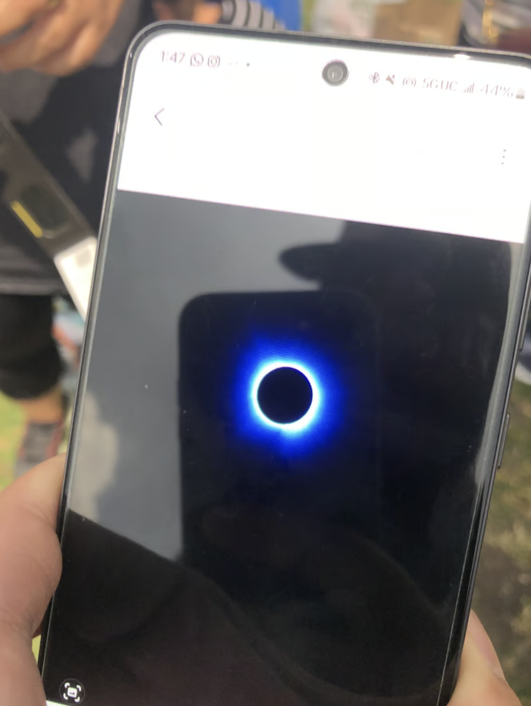
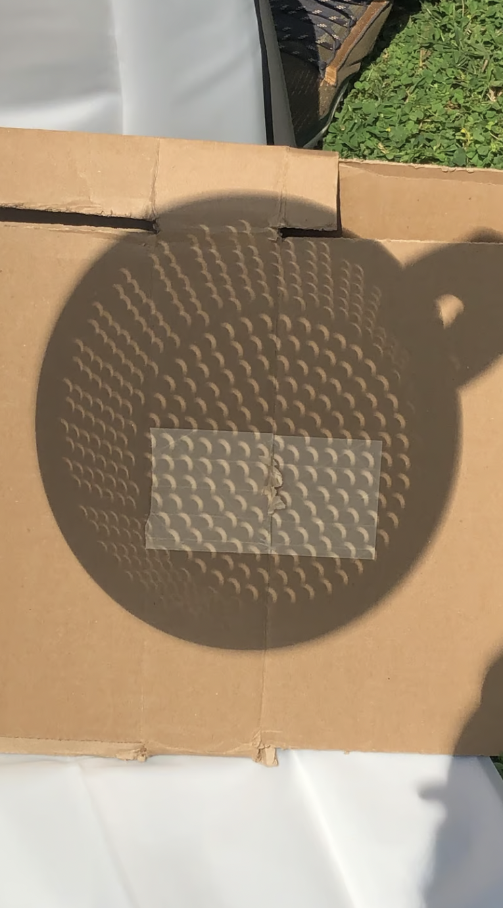

__partial eclipse shot I took from a binocular__

It is April 8th, 2024. The day of the total solar eclipse, that passes through USA Mexico and Canada

It's also my 3rd day without a place I can call home, as I just moved and sold/donated most of my possessions. I don't have a permanent house address either. I am living a nomadic lifestyle and working remotely

On this day, I went to a Solar Eclipse viewing party that I found through meetup in Dallas, TX. This party had both a yoga event going on, while hobby astrologists were setting up hubble-level telescopes in the background

It is quite a strange sight to see. There is always some level of parallels between seemingly unrelated hobbies - dancing and tech, yoga and astrology, etc.

I greet the organizers. But before the event starts, I decide to load up on food supplies at the grocery store across the street. I get excited and buy a pinhole projection device too (e.g. a collandar with holes) to nerd out with some of the hobby astrologists there

As I walk back across the crosswalk, excited to reunite with the party, a person aggressively honks at me while I am crossing with right of way. 

It leaves me flabbergasted. In this moment, I am confused; I am frustrated. Are Texans normally like this? Did I do something wrong?

It occurs to me that in this moment in time, this person is just an asshole. Maybe he/she must get somewhere quickly or has a lot going on in their life, but I feel unfairly honked at. 

I feel betrayed of expectations. I expected to walk in peace, on a crosswalk, to my destination to share my excitement of pinhole projectors that I spent weeks thinking about

<!-- a person walking on a street confused with a car honking at him, abstract art style -->

There is a book called ["the subtle art of not giving a f*ck"](https://www.amazon.com/Subtle-Art-Not-Giving-Counterintuitive/dp/0062457713) from Mark Manson. In it, it says if you don't have many f*cks to give about, even small things really bother you. I'm at a point of change and embracing unknowns in my life, so I don't have many points of stability

I am now conflicted between two ends. I don't want to spread this negativity, this anger to others. Neither do I want to ruin my own experience watching this eclipse either, by being frustrated

In these moments, I find it hard to let go. I find it hard to forgive, I find it hard to be focused on the thing I came here for. 

I do my best to spread it slowly over time instead - inwardly and outwardly over a larger surface area. I acknowledge that I am at an emotional negative high, and will deal with it later.

My mindset shifts though, as the eclipse is progressing towards a full path of totality. There is awe and excitement in the air

It's a weird feeling for sure. It feels like I am looking at a computer monitor, but the light settings are dimming very quickly. Then the temperature drops a few degrees, and there is a slight cool breeze from the shift in temperature

As the path of totality sets, I look up at the sky. Where the sun normally is, there is a dark black circle, with a glowing edge. I have never seen anything so beautiful up there.

__a picture of a picture after the fact__

My brain stops functioning around now. It doesn't really know what it's looking at. It's stared at the sun hundreds and thousands of times, but has never seen this before, nor the change in day to night so quickly.

In it, my subconcious feels betrayed of expectations, but in a good way. 

I am just enjoying this present moment in time for a few minutes. Nothing else matters.

As the moon unblocks the sun, and things get bright again - I put on my solar eclipse glasses. I am still processing what just happened

My mind shifts as I forget to do the pinhole projection experiment. Someone else is already doing it, and here is a picture of a collander with circular holes

As the Solar Eclipse event comes to an end, I had completely forgotten all the things else that I had going on, including the frustrations earlier. And that's okay

I've come to realize change requires new experiences. Negative experiences can be overwritten by stronger positive ones.

You can recondition yourself through these new experiences. Through embracing the fear of the unknown. Through challenging yourself into new situations. Through exploring new profound enlightening experiences

All of this - to become a more mature version of what you want to be. But it always starts with you. You have to step forward yourself to embrace the change - to put yourself on the path of totality.
