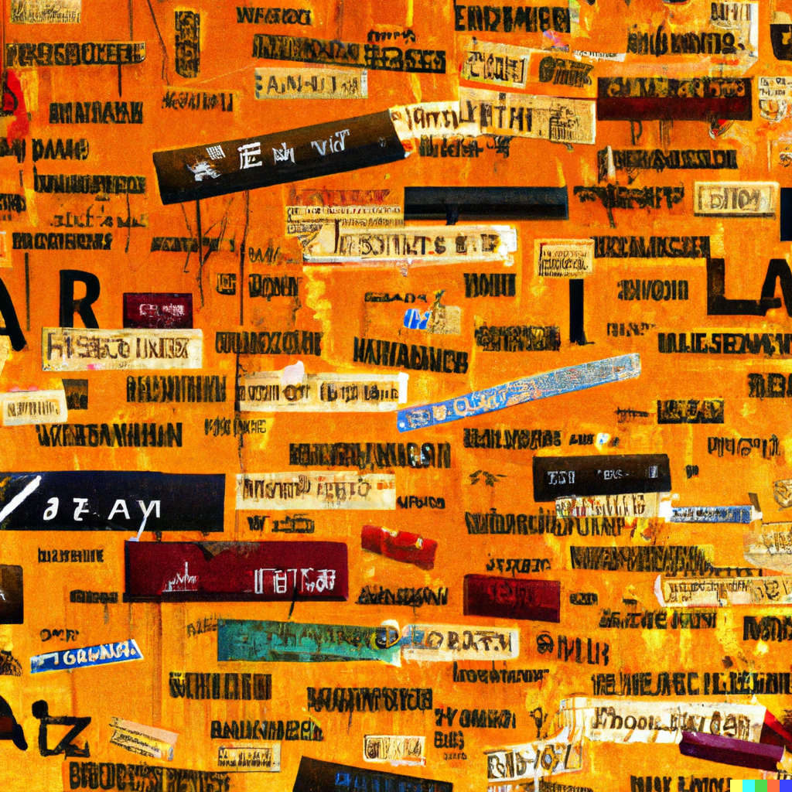

<!-- DALLE - a wall of words in different languages that is melting, surrealism style -->

The definition of Linguistics is the study of language - it's structure, how it's acquired, how people use it, its history, etc

It's a field I don't really know that much about nor have researched. But it has me thinking more about it, since I've recently embarked on a digital nomad lifestyle, and I am seeing the stark differences between city cultures in America for the first time

> These are just my opinions below, I am not an expert on this topic. I am going to provide ancedotes of my life and from others I have met as a basis of supporting notes to an argument, with supporting notations

I grew up in a very international city - Orlando, FL. It is a city where every language, every culture is present. Maybe in the residents that live there, or the tourist visiting the theme parks, etc. 

In my time there, I worked many years in customer sales/support for an international trading company. Many of the people I'd talk to didn't speak any English

Often times I would have to be creative when it came to communication. Sometimes I would use what I thought was rudimentary handsigns. Things like 👍 or 👌 and point to an item, if that's what they were referring to. 

The client would respond with a head nod, or some body language cue. 

Other times, I would seek out what common English they knew. And I would build a dictionary of communication between me and the client. It's like a secret handshake language of sorts

<!-- Monkeys talking to each other, abstract art style -->

I learned you don't really need a lot of words to communicate - if there already is an assumed context of buying/selling goods

Basic in-person communication is what I understood at the time to be a combination of body language cues, tone, context of the situations, the person's culture, and words

> This is something you will realize yourself, if you've travelled to other countries. There will be times you are lost, where you ask for directions. Sometimes you'll do it in their native language but they'll just respond back in English. 

> It could be because you don't look like a native, or your accent/pronounciation is very different - or your just in a touristy area, so its the assumed context. Or a combination of all the above

## A take on words

If communication in-person is done through a combination of many factors, what then is the cultural significance of words?

Do words over time take on meaning, based on the social context they are always used in? 

You might be asking what I mean by this, so it's easier to describe it in a ancedotal story format

I met someone that grew up in the Middle East, in a very religious community. He is ex-religious now, but the very two decades of his life were very religious

In the Arabic langauge, there is not a direct 1:1 translation for the word "gaslighting". 

When he had first learned of the English variant, a flood of emotions would come crawling back, because he could not label parts of what he had been going through his life at the time.

You won't find alot of notes on the translation either online, just this [random reddit thread](https://www.reddit.com/r/translator/comments/utx8u2/englisharabic_one_word_translation_of_gaslighting/?rdt=51148). Because the english variation of تلاعب بالعقول does not convey the same sense of emotions a the English variant does

Here is another example of another word, this time that only exists in it's language. Schadenfreude. In german, this is

-  the experience of pleasure, joy, or self-satisfaction that comes from learning of or witnessing the troubles, failures, pain, or humiliation of another

I first learned about this word from [Tom Scott](https://youtu.be/QYlVJlmjLEc). Schadenfreude seems like a very Germanic word, because there is a strong sense of perfection in it's culture.

<!-- DALLE - yin yang symbol, synthwave style -->

In my own culture in Chinese (Cantonese) we have words that are also not conveyed in any language

This is the word ["YEET HAY"](https://circledna.com/blog/demystifying-yeet-hay/) or 熱氣. The origin of this word is based strongly in Feng Shui and Buddhist ideologies

It is a word we use when we eat a lot of polarizing food, such as spicy or junk food. And that energy radiates in our body which then produces sore throats, acne, sickness, fatigue etc. It implies that these foods are inherently not good for you, but they can provide a sense of comfort. 

Now lets look at indian culture for example. Spicy food stimulates the taste buds, creating a [sensation of heat and excitement](https://medium.com/@sayandeepbanerjee26/5-reasons-why-indian-food-is-spicy-a-journey-of-flavor-and-culture-906966bd0943#:~:text=Indians%20have%20developed%20a%20preference,dishes%2C%20making%20them%20more%20enjoyable) providing enjoyment to those that like it. 

## What then is the cultural signifiance of words?

When we look at outlier words in different cultures - and the effects they have on those experiencing it for the first time from another culture - they provide a strong scientific sense of non-confirmation bias of what words really mean

Because we are seeing a dichotomy of cultures clashing, with generations and generations of context and stipulations behind it. 

Words therefore from this context, is based on the emotional and social constructs from which the origins it is established in

## The bias of words

Words can be seen as negative, neutral, or positive. This is based on the social constructs it's used in and understood as in mainstream culture

Here is an example. If someones describe you as an "Overachiever", it has a negative connotation to it, depending on the context and tonation it's used in

It usually is stated, when you are building things, or accomplishing goals you set out to do. 

In this case, it is better to think of yourself a a "Builder/Creator" of things - because there is no implied negative connotation to it, and it is more neutral in tone

In the spinoff case, someone who builds a lot of things - communities, cool things, etc might be described as "Inspirational". This is the positive connotation

It's important to note how you describe yourself in words. How you label yourself. How you subconciously label things happening around you. 

Because there is sometimes an inherent bias in words, which in turn creates a internalized mindset shift over time depending on how it's used

<!-- DALLE - beaches and waves, digital art -->

## Closing thoughts

There is power in words. They all have different energies and context.

Embracing a very negative word over a long duration, creates a more doom and gloom outlook on life. It is more pessimistic and helps plan for the future

Embracing a very positive word a long duration, creates an overly positive outlook on life. It is more optimistic, and relishes in past moments

Embracing a neutral word over a long duration, does neither and is more secure. It is more present in the moment and more realistic, but it can be boring

These connotations have their pros and cons. The words you choose to use should be a reflection of who you want to be, and the life you've lived. 

It is better to take a stance on things then not to take a stance on anything