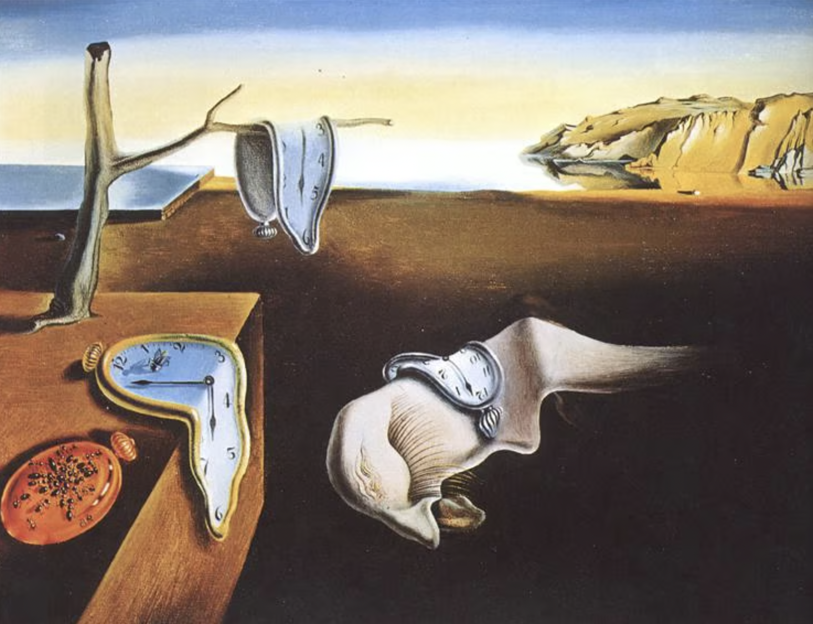

__Salvador Dali: Persistence of Memory__

This is a tip I learned from a pilot

If you like math - use military time on your phone. 

Instead of things being labelled 1:00 pm, it is 13:00 hours instead

There is less confusion overall between whether something is in AM or PM time. For most people this doesn't matter, since the context is usually obvious in communication

For someone that works with others across different geographic regions, it can be helpful

Military time provides a sense of routine, a sense of discipline, by making you do math everytime you look at your phone. 

It keeps your brain mentally sharp, and makes pursuing higher level learning easier. 