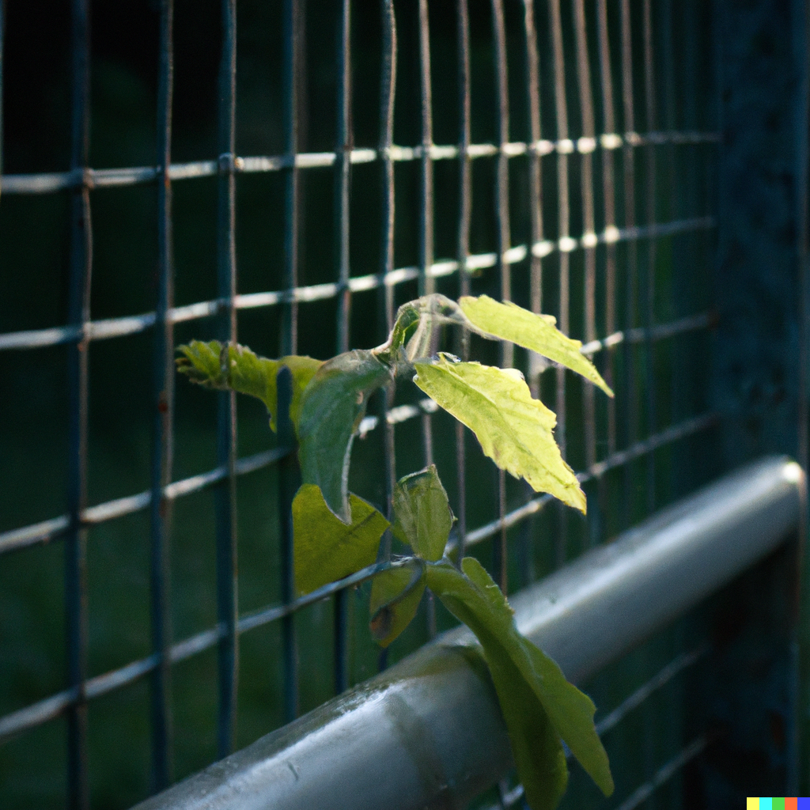
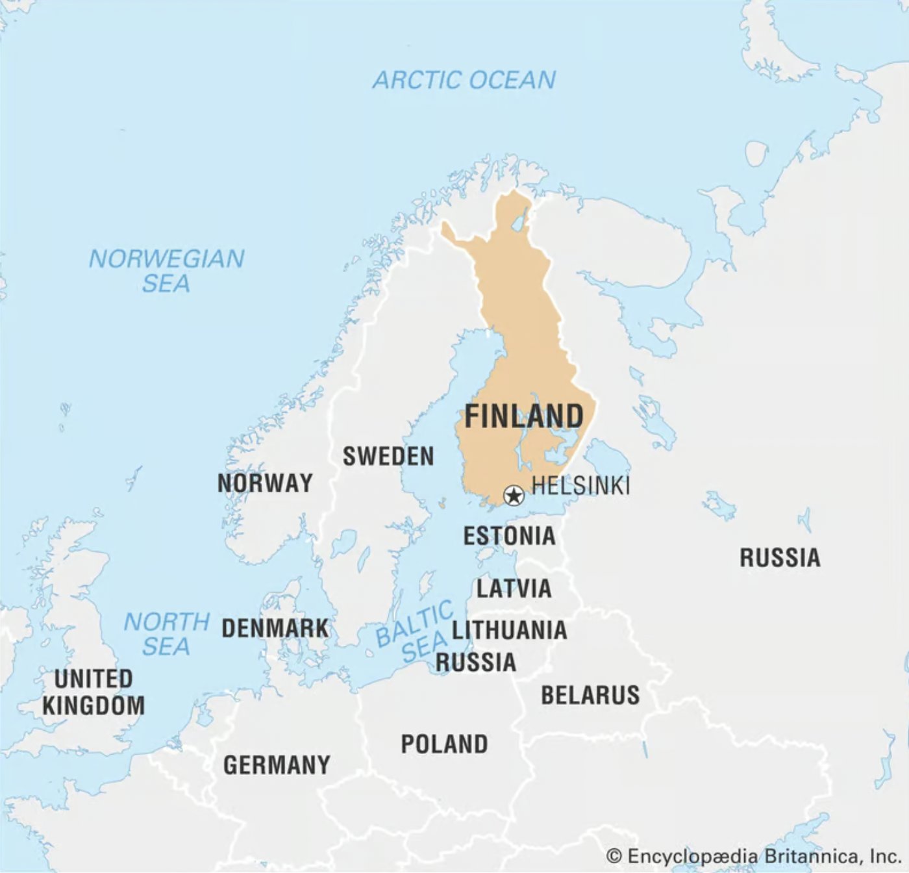
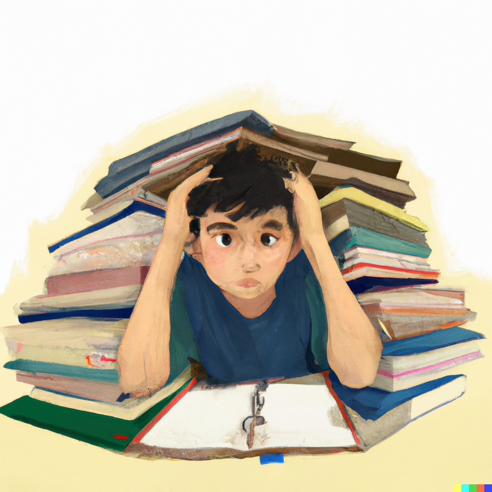

<!-- DALLE - growing past boundaries -->

There is a book called ["the smartest kids in the world and how they got there"](https://www.amazon.com/Smartest-Kids-World-They-That/dp/145165443X). It talks about the effectiveness of K-12 schooling and education from around the world. From Europe, to Asia, to America.

It talks about how these schooling systems differ in various countries. For instance, in South Korea, the culture tends to be very strict. There is a high rate of stress and pressure on the kids to do well. In many of the standarized tests, the students perform well, but they also work gruelingly long hours including parental mandated afterschool studies. Students can often times suffer from lots of health problems

In another culture such as America, the K-12 education system widely varies depending on the rating of the school (rated from F to A+). It closely has some parallels to the socioeconomic status of the area, better schools tend to be in more affluent areas as there is more money and more funding. Private schools are the exception here, whether this is a religious school, charter school, STEM school, etc

Germanic schooling tends to fair very well here too, as there is a sense of perfection and rules in it's culture. The government provides a lot of resources for those pursuing higher education

However, there is though one culture that is heavily highlighted in the book though as one of the "best" K-12 educational systems in the world, and that is of Finland. 

When we look at the K-12 educational system there, it's first and foremost important to understand the culture. The culture is a very peaceful, neutral country surrounded by mountains. People there tend to their own business, there is not much small talk. There is also next to no socialeconomic conflict or issues either

Because of a lack of notable issues, a bigger emphasis can be made elsewhere, such as in the education system. Being a teacher is a desired profession in Finland. The pay is considerably higher than those in the states, and teachers are treated well

Teachers in Finland do things a bit differently. They are given a large amount of freedom to educate as they see fit, to the individual needs of a student. Regulations are lead by educators, and not bureacrats

There is also less pressure on the teacher, less standarized testing, and things are a more relaxed atmosphere overall.

A student is given the oppurtunity to explore their own individuality. And the teacher fine tunes their curriculum to the student's interest

In many ways, the student develops a sense of the world on their own. They **learn without boundaries**

Whereas in other schools such as those in Asian culture, military like discipline tends to be the norm. Math must be perfected, a student must take on many hobbies like playing the Piano, etc. Education is very much forced, with boundaries and stipulations of becoming a doctor, lawyer, engineer, etc

<!-- DALLE - a kid buried in schoolbooks to study, digital art -->

When someone is given the oppurtunity to safely learn on their own, and the oppurtunity to fail where failure comes at almost no time or monetary cost, they are learning without boundaries.

No boundaries in the sense where the sky is the limit. You can learn anything you want. Anything you find interesting. The reward feedback loop, is your own learning. You develop a deep sense of trust of yourself, your own knowledge, because well you chose to learn it yourself. The teacher simply provided a sense of guidance, an evolving framework, to your designated path of your choosing.

This evolves to some level of creative original thinking. There is not a conformist level buy in to mainstream culture necessarily. 

Digressing away from the book - the teacher doesn't necessarily have to be a person either. It could simply just be a book you picked up at the local library. It could be a youtuber who you aspired to and learned from. It could be an MMO video game like runescape where you experimented and ran your own virtual business online. It could be a number of different things

Those that don't learn without boundaries, they usually develop a completely skillset. For someone that did not grow up with money, working ends meet - this means putting food on the table. Survival by money. Have the burden of always thinking short term puts a stoppage on the luxury of learning. Dealing with foodstamps, paycheck to paycheck, etc. 

<!-- DALLE: a kid selling lemonade on the streets, digital art -->

If you didn't **learn without boundaries**, what usually happens is you resort to copying others who did. But you will lack the original foundation that they have built, and what seems to work for them may not work for you

It's always important to focus on the principle first. First, deal with your boundaries. Then find a way to have the luxury of time without pressure, to learn without boundaries. It's easier said then done. This usually means making more money, getting your foot in the door to a higher paying job as soon as possible

These boundaries may not always be necessitated by time or money, but also by social conditioning. You may have grown up being told certain ways of thinking are wrong, or rather encouraged to think a different way (such as with religion). Or being told things are not possible, or having an agenda forced down on you all the time. These take much longer to heal, to grow out of as things need to be unlearnt - if you choose to go down the path of **learning without boundaries**

When you do learn without boundaries, you can be a creative original thinker - and break out of molds you don't want to be in, and embrace new ventures you didn't know existed