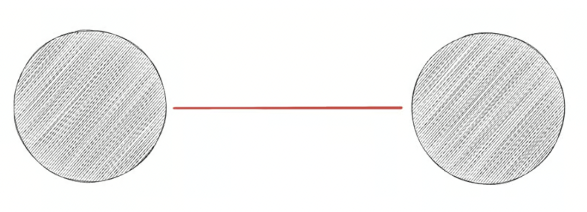
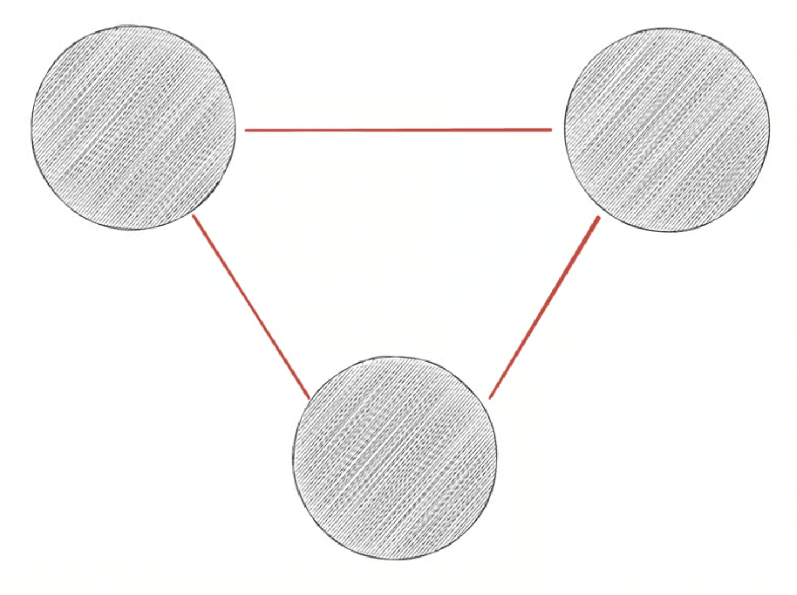
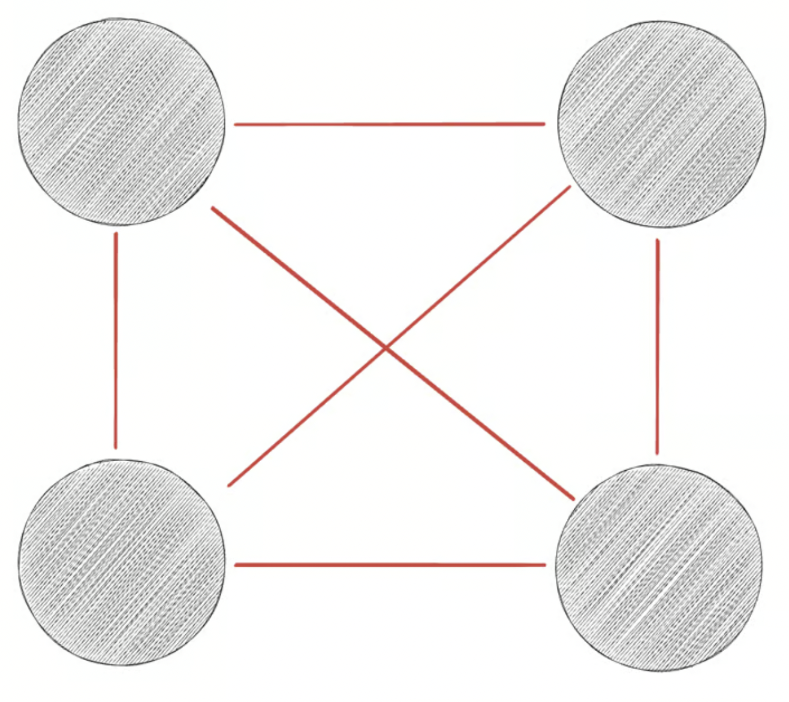
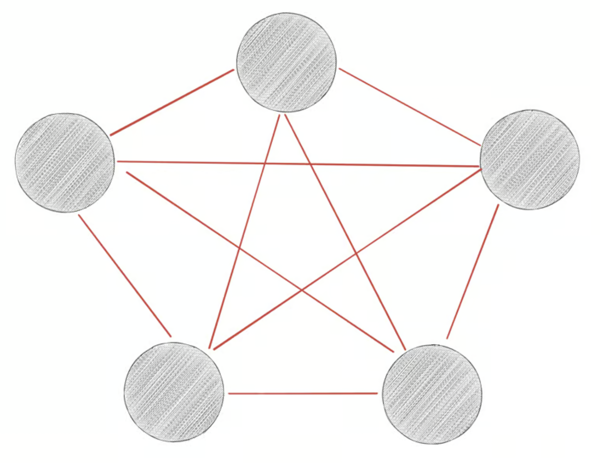
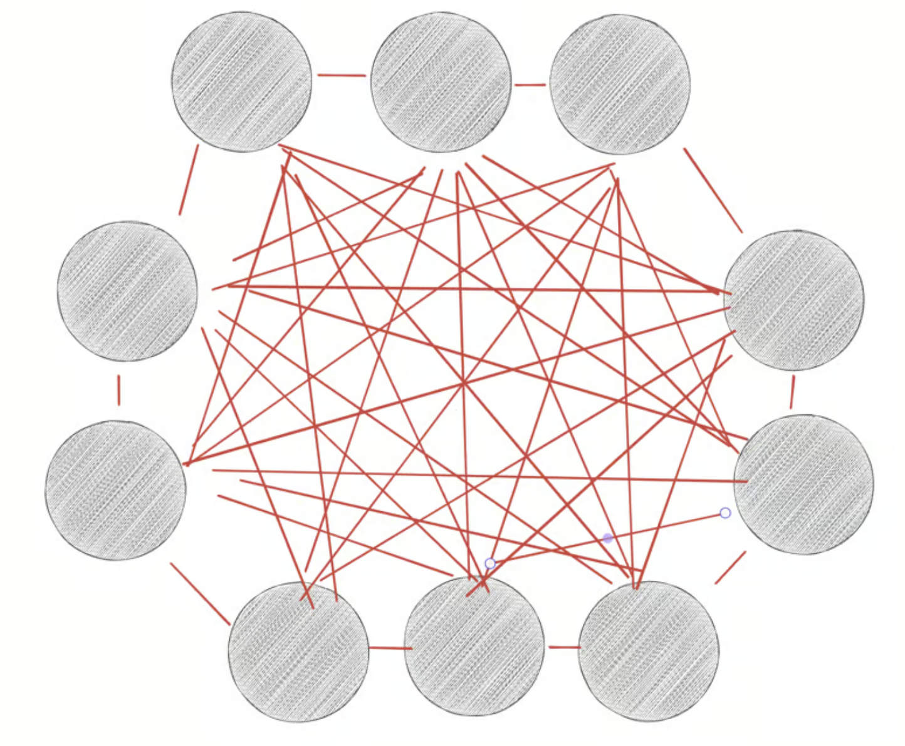

In a [minimalist](https://www.vincentntang.com/embracing-minimalism/) point of view, less is more. 

It could the stuff you own. The people in your life. The goals you focus on. Bookmarks. The number of hoarded domain names on your registrar that never become anything but that.

But why is less better overall?

By drawing your attention to less entities, you draw a stronger relationship to the entites you [keep](https://www.vincentntang.com/deciding-what-to-keep/) around

It's far easier to represent this in a mathmatical sense, using a diagram

If you have two entities, this is what that looks like:

There is one red line. Think of that as the relationship from one entity, to another - with a common theme behind it. Think of it as a best friend diagram, where you and 1 other best friend is represented here

Now let's take this one level further

With three entities, there is three relationships. You have two best friends. They talk to each other too. Let's look one step further

With four entities, there is six relationships. It gets a bit complex now

With five entities, there is 10 relationships. Let's skip ahead and go to 10 entities instead:

Congratulations, you know what it means to be a politician now. There are 45 red lines relationships in this circle. Everything you do has an indirect consequence elsewhere

The mathmatical formula for the number of relationships is this, where N is the number of entities

- ((N - 1)*N)/2)

In mathmatics, we call this [the handshake problem](https://www.ucd.ie/mathstat/t4media/1.%20The%20handshake%20puzzle.pdf). It is the number of handshakes that are done based on the number of people present

Going back to this diagram theme, having 9 best friends means it becomes a job in itself to keep track of who does what. That means goodbye focus. It means you've said yes to so many things that you said [no](https://www.vincentntang.com/its-ok-to-say-no/) to things that mattered.

There is a theoretical limit of how many stable relationships you can have. It's 150, according to [Dunbar's number](https://en.wikipedia.org/wiki/Dunbar%27s_number). 

These relationships vary in nature. There are a few you can trust with just about about anything. Others for specific hobbies. Some as work related functions. And others as neighbors. 

And these entities don't have to be about people. It could be things you possess. Goals that you have. Ideas for a gajillion companies you want to start. Anything. Really.

Each theme represents a different diagram mentally in your brain.

It's important to keep in mind that you only have so many diagrams to keep track of. And so many red lines within each of them. Each time you add another red line or another diagram, you dilute everything else in the process.

> Another way to think of the red lines is [synpases](https://en.wikipedia.org/wiki/Synapse)
