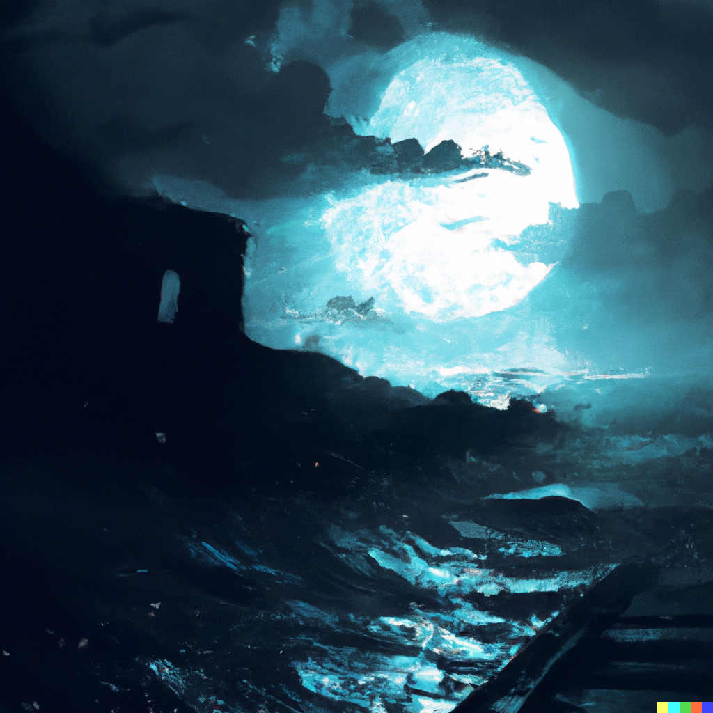

_DALLE - llamas staring at macchu pichu in the style of starry night_

Writing is an art form. It can be short. It can be long. It can be written in ways that are more poetic. Or terse. It can provide a point, a call to action. Or simply tell a story

This style of writing comes from [Gary Provost](https://www.goodreads.com/quotes/373814-this-sentence-has-five-words-here-are-five-more-words) from 100 Ways to Improve your Writing. He said this:

- Write with a combination of short, medium, and long sentences. Create a sound that pleases the reader’s ear. Don’t just write words. Write music.

This quote has me thinking about my own writing style. How I put words on a page. How I go back, and edit those words. How I then put pictures to add breathing space to the writing. 

It's changed a lot over the years. As I've developed a stronger sense of self. And experienced new things.

I have developed some sense of what my writing style is. To me, it is poetic public journaling. It is many parts of my ideals, coming onto a piece of paper

There are though some core rules I've developed for myself. This is to provide a framework. To which I can write more fluidly, more easily, to transfer those thoughts on paper

_DALLE - the calm before the storm, digital_

Here are those rules:

Everything starts by capturing an adhoc sense of notes on paper. Through private journaling. These are ideas that are half-baked, and the best ones rise to the top, over time. 

Then a title pops in my head conjoining related ideas. And my brain stitches it together. 

When it comes to laying down words on a page. I start with a central common point that is understood. It could be a book I read. A quote online. Some form of inspiration that comes in the fleeting moment, when I stare at the blank white page on the screen.

These paragraphs are simply just streams of concious thoughts. Every few sentences, I [swap hats](https://www.vincentntang.com/describe-hat-wearing/). Between writing and editorial modes. Sometimes between first and third person. The only order is what sounds good to my ear, when I read it aloud. Like music. 

It is still a work in progress. Writing to me is like riding a bike. I still fall over a lot. There is an old proverb though, in which practice makes perfect.

And when that perfection is there, I can just reproduce it again at anytime. 

This ideology of writing as an art form, is not just limited here. It is everywhere. It is how I [code](https://www.vincentntang.com/Writing%20a%20custom%20userscript/). It is how I do [branding](https://www.vincentntang.com/designing-the-bayhacks-logo/). It is how I build and [manufacture physical products](https://www.vincentntang.com/designing-coolest-embroidered-hat/).

It provides a [sense of self]
(https://www.vincentntang.com/maintaining-a-sense-of-self/) for me

Anyone can be their own form of inspiration. It's simply a matter of capturing the state, the style, in whatever form you want to emulate again. Or improve upon