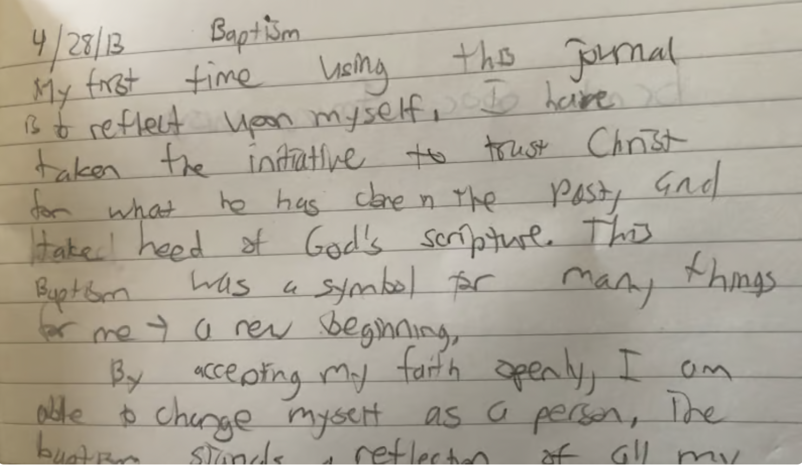
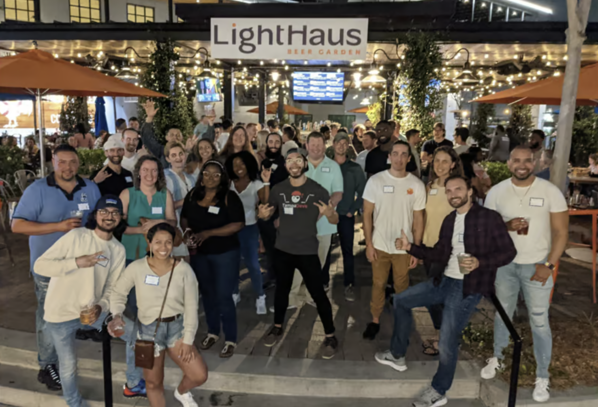

Many years ago, I was in a dark place in life. 

A place in which felt like I lost everything. A place where I spent years working on a goal, only to be met with failure. A place that I spent years dedicating my life too, only to be outcasted and publically humiliated along the way. A place where I lost all my social circles in one shot. Ex-communication

It was an all time low for me. I was vulnerable. So I took the first guidance given to me. I became a Christian. For the better part of a year. 

This is something I'm not exactly proud of sharing. But here is a journal article I wrote in 2013

For anyone that knows me, this writing will come as a shock. I am not religious. Not in the slightest. I am a man of science and principle

When I eventually left Christianity, I turned elsewhere for guidance. I did some soul searching on the web

This was the first time I learned what a "self-help" book was. I read many of them, including forums and online articles. I read [many quotes](https://www.vincentntang.com/journey-not-destination/) that spoke to me, one was this:

**"Stories are the currency of human relationships"** from [Robert McKee](https://www.goodreads.com/quotes/6715854-stories-are-the-currency-of-human-relationships)

For many years I did not think too hardly about this quote. Not until I started my career into [coding](https://www.vincentntang.com/how-hackathons-got-me-a-job/).

I started to write things for myself. In code. Software I needed to make my life easier. Then I made it public. And people loved it, and asked me to develop new features on it

The career trajectory I had in coding was this sort of inspirational light to others. People wanted to know my story. What made me me. And I was asked to do [interviews](https://builtonair.com/boa-podcast-s02e08-vincent-tang-airtable-super-producer/), not for my first job, but rather for the story I had

After I got my first job, and stabilized in the field of software, I ended up wanting to tell more stories. So I created a [podcast](https://codechefs.dev) to tell mine, and others.

Then Covid happened. I became the leader everyone wanted me to be. I started a local community in Tampa called [Tampa Devs](https://tampadevs.com). Again, I was seen as this inspirational light to others starting their career

_tampa devs event, 2022_

2.5 years later, I [left what I started](https://www.vincentntang.com/how-it-feels-retiring/). It was a series of [letting go](https://www.vincentntang.com/letting-go-and-solar-eclipses/) and moving on with my life, currently now as a digital nomad.

I'm a week in this trajectory. And it's made me realize I never actually chose software development. It was a necessity. A necessity to obtain financial freedom and to leave a situation I didn't want to be in. A necessity for others because I was good at building the things they needed. A necessity for others as they needed an inspirational light.

But I never chose it for myself. I never chose to be a software developer. I never chose to be the leader. 

It was just expected of me. I was on a journey to learn more about myself, and this was just a phase of my life

This whole phase has caused massive strife in my life. Identity crisis. A [lost of self](https://www.vincentntang.com/maintaining-a-sense-of-self/). The feeling of [losing everything](https://www.vincentntang.com/deciding-what-to-keep/) all over again

_skyline, Dallas, TX_

Now I am in Dallas, at my first ever tech meetup I am not running. 

I met an [organizer](https://twitter.com/DThompsonDev?ref_src=twsrc%5Egoogle%7Ctwcamp%5Eserp%7Ctwgr%5Eauthor) who went through the same inspirational light trajectory as I did. Someone who's helped not dozens of people find jobs like I have, but hundreds. Someone who actually wants to be the inspirational light, in the field of tech. Someone who has spent equally as much time in his career as I did

He started from absolutely nothing, from the bottom. As a guy flipping burgers for 10 years. 

And his story was **infectious**. A rollercoaster of emotions. It was everything everywhere all in one shot. Someone who knows who they truly are. 

I don't remember the last time I have felt so inspired hearing someone's story before. Maybe because I have lived so many parts of his career trajectory, but I've outright rejected the path I forged. Here is someone who did the total opposite

And I've come to realize, I don't know what my story actually is. I don't know where [life will take me](https://www.vincentntang.com/its-okay-no-plan/). 

All I know is I am not ready to settle down just yet. There is something that calls to me. I see a blank image of my future, and only parts of it are revealed. I don't know what the other parts are, but I want to know more of my story
