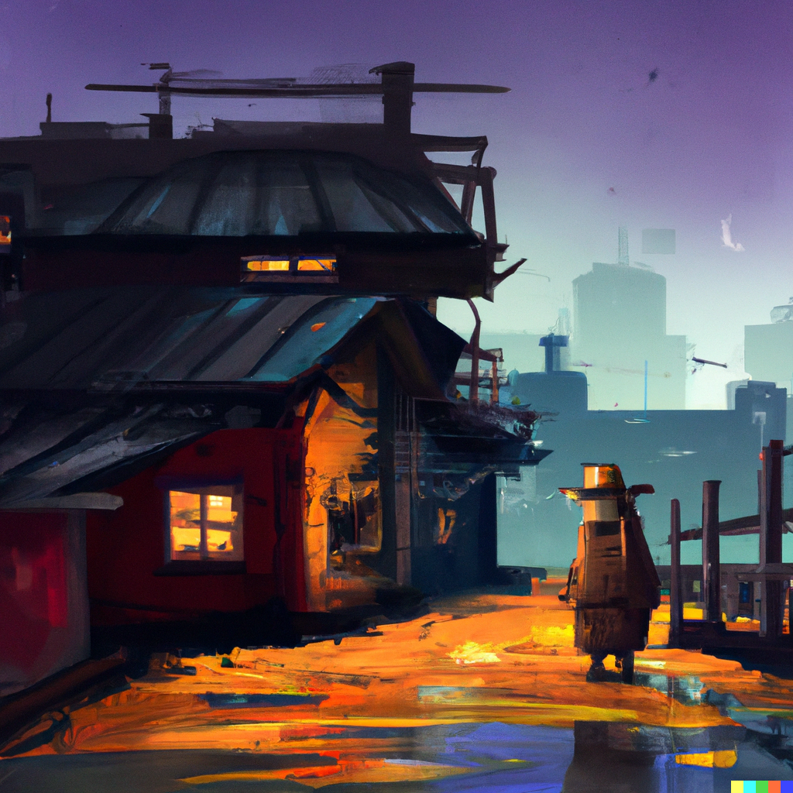

_DALLE- Stories woven into a dream, digital art_

There is a quote from a famous screenwriting lecturer from the University of Southern California, named . 

In the University of Southern California, there is a screenwriting lecturer by the name of [Robert McKee](https://www.goodreads.com/quotes/6715854-stories-are-the-currency-of-human-relationships). He is known for his story seminar. A seminar in which students, business professional, film makers, and people from all over the world would attend. To learn how to tell better stories for movies, marketing campaigns, comedy, and anything that revolves around creative content

One of his famous works is a quote he gave. It summarizes the years of work and wisdom in the field. It is this line:

**"Stories are the currency of human relationships"**.

Stories are often times the hallmark of what makes us, us. We are a combination of the stories we hold. From living them ourselves, to those passed down from generations from our ancestors. It is what connects us unique, it is how we connect to others in an emotional sense

## A story about my career

I read this quote in a time-frame of my life where I read a lot of self-help books. A time in which I would go down a rabbit hole, drawing inspiration from others I could learn from. Either the quotes of wisdom they had. Stories I could relate to. Something to help make sense of where I was in life, and where I wanted to be.

I didn't think about this quote for many years. Not until I started my coding career 8 years ago.

The gist of my coding career is this - I coded for fun. It was an outlet where I could explore, create things, and help make my life easier. I built things that were useful to me. 

Some of those things I created, I made publically available. To help others who were in the same position as me, and needed the same tools.

I wasn't even a software developer back then. But people desired new features to the tools I made. So much that I would go on interviews not for jobs, but for the [community work](https://builtonair.com/boa-podcast-s02e08-vincent-tang-airtable-super-producer/) I did.

After I got my first job, I became this inspiration for others. People would look up to me, and know my story. A person who didn't go to school for software development. Someone who taught himself for free on youtube. 

I told my story in a few podcasts I was invited too. One of them inspired me to start my own [here](https://codechefs.dev), to tell more stories

Eventually Covid happened. I got laid off. I started a software development community in Tampa near the peak edge of it. I had the right skills, the right connections, the right motivations to do it. 

_tampa devs event, 2022_

It became a hot success. I would still be this inspiration for others around me, looking to pursue software development. 

To me, it was an outlet where I could express my creativity. A place where I could build things. And the byproduct was something useful for others - a place to make connections to help jumpstart their career into tech. A way I could pay it forward for the help I got in my own career

Among my friend circle, there was a call for help. Two of them were going to be exported out of the USA if they didn't find jobs. And I had the power, the connections to help change that

I took on the role of leadership, not because I wanted to, but because it was a self-sacrifice I was willing to make for others

Only long enough for them to find jobs. And then, I would leave, and continue the life I wanted to lead.

One thing led to another, and things grew beyond expectation. I didn't want to make it a business at the time, but it became just that. A 501c3 nonprofit. It was a self-sacrifice in ideals for something beyond me. 

When it came time to [step down](https://www.vincentntang.com/how-it-feels-retiring/), to focus on me, it was harder on others more so then myself

When I let it all go, I realized almost all my connections I had in my life, could not see me other than this inspiration in their life.

I made this self-sacrifice for others, but it also came at the expense of my own well being. I was what others wanted me to be, but barely anyone saw me for what I actually am. A creative builder. Not a tech leader

Because of this identity dichotomy, I [lost so much](https://www.vincentntang.com/deciding-what-to-keep/) along the way. A [sense of my self](https://www.vincentntang.com/maintaining-a-sense-of-self/). Not knowing who I was, or who would stick around to see me as just a regular dude living his life.  

Eventually I decided not to renew my lease, and move. To start fresh, to be the person I want to be.

_skyline, Dallas, TX_

## Dallas, TX

Now I am in Dallas, at my first tech meetup that I am not running.

I met the [organizer](https://twitter.com/DThompsonDev?ref_src=twsrc%5Egoogle%7Ctwcamp%5Eserp%7Ctwgr%5Eauthor) who went through the same career trajectory as me. Except he started from the bottom, whereas I started from the top

His story is this - he worked 10 years flipping burgers at a gas station. Then he had a quarter life crisis, decided to turn it all around when he heard about coding

He made it big - a rags to riches story. And now he is passing it forward in every way possible - not as a self-sacrifice, but rather because this is who he wants to be. 

There were just so many random bits of stories I could relate to. Stories of making an impact to someone from Nigeria while living in the USA. Stories about dealing with big name sponsors willing to throw money at you, and just telling them no when you had nothing. Stories of helping dozens of people get their first tech jobs.

There were so many wild and crazy stories. Stuff that doesn't sound believable. Yet for anyone who's lived through the same 
career trajectory, they are so real

His story was **infectious**. So much that I told the Uber driver along the way back to my hotel, and it may have inspired him to take up coding too

It's also made me realize that I am not a tech leader. Here is someone who knew who he truly was, and I could feel it. That was not me. I made a self-sacrifice; he did not

This begs a bigger question for me

I don't know what my story actually is. I don't know where [life will take me](https://www.vincentntang.com/its-okay-no-plan/). 

All I know is there is something that calls to me. I see a blank image of my future, and only parts of it are revealed. I don't know what the other parts are, but I want to know more of my story