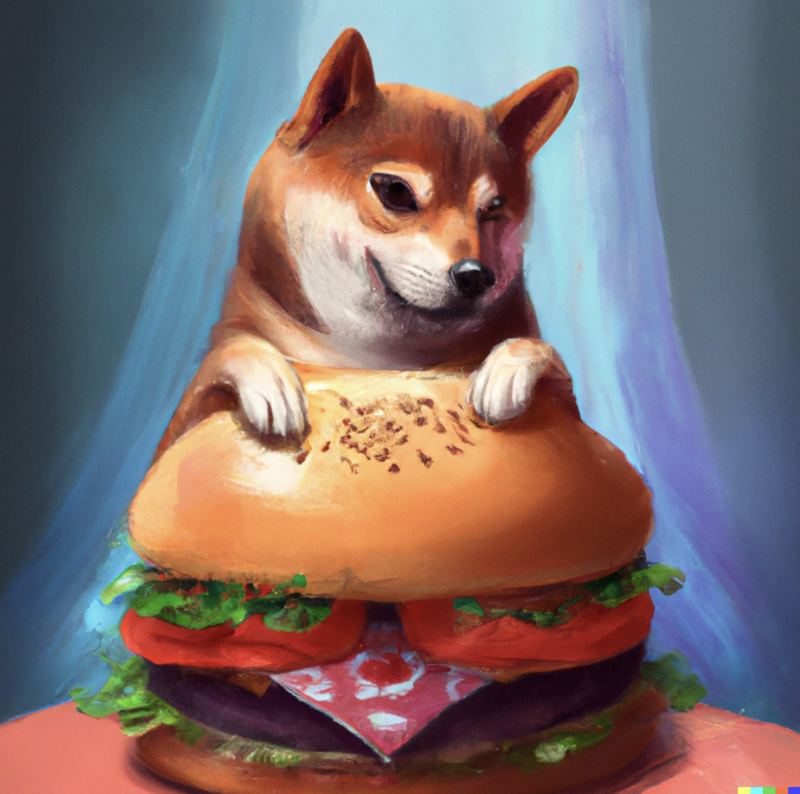

Change is scary. 

It is trusting your gut. It is powering through the fear of of the unknown. It is leaving behind a sense of comfort. 

It is embracing the uncomfortable things in life. Doing the complete opposite reactive thing that you are normally used to. 

It is an absurd concept for many. It means you have to look inward. To be strong enough to see all the parts of you, including the ugly ones. It's not something everyone has the resolve to muster; the courage to do

Giving up the responsibility of looking inward is the easier path. It is easier to go with that is prescribed to you.

From your culture. From your ideologies and religion. From your parental figures. From the control you exerted over others to feel important. From what you grew up with in your comfort zone. From your hobbies. From someone you aspire too and want to emulate. 

But you will ultimately be on someone else's blueprint.
You won't develop a sense of understanding on why that blueprint exist. You will copy without understanding the underlying foundation. You will be an inferior version of someone else

That is okay for some. To live a life where you feel everything is known, and understood in your world view. 

That is not the path for me. I want to know what my unique blueprint is. One that is not a path treaded often. 

This means letting go. Of tools that I rely on. Of hobbies. Of many things and people in my life. 

This means I have to be okay not being liked. I have to be okay leaving behind the comforts of escapism, and embrace reality as it is. Including when it's boring, and uncomfortable. 

But there is some beauty in knowing what one's underlying foundations are. 

Once you understand it, you can rebuild a new one. A foundation in which you don't have to people please because it's native to your culture. A foundation in which you don't reach for social media when your bored. A foundation in which you don't rely on attachments to get validation. 

Of course, you'll keep all the things you know. All the skills and knowledge you already have. You will just be doing things a little differently. 

But this time because you want too, and not because someone told you so. You don't self-sacrifice your ideologies and your beliefs, to live someone else's dream - even if it was the right call at the time.

It's then you will develop the strongest version of yourself. One in which you develop skills you might suck at, but really enjoy doing and get better at. One in which you find what really inspires you - because you freed yourself to new things. One in which you can make a career of your own choosing - because you forge it yourself

Embracing change sucks. In the short term. In the long term it pays off, and only you can be the change you want to be.