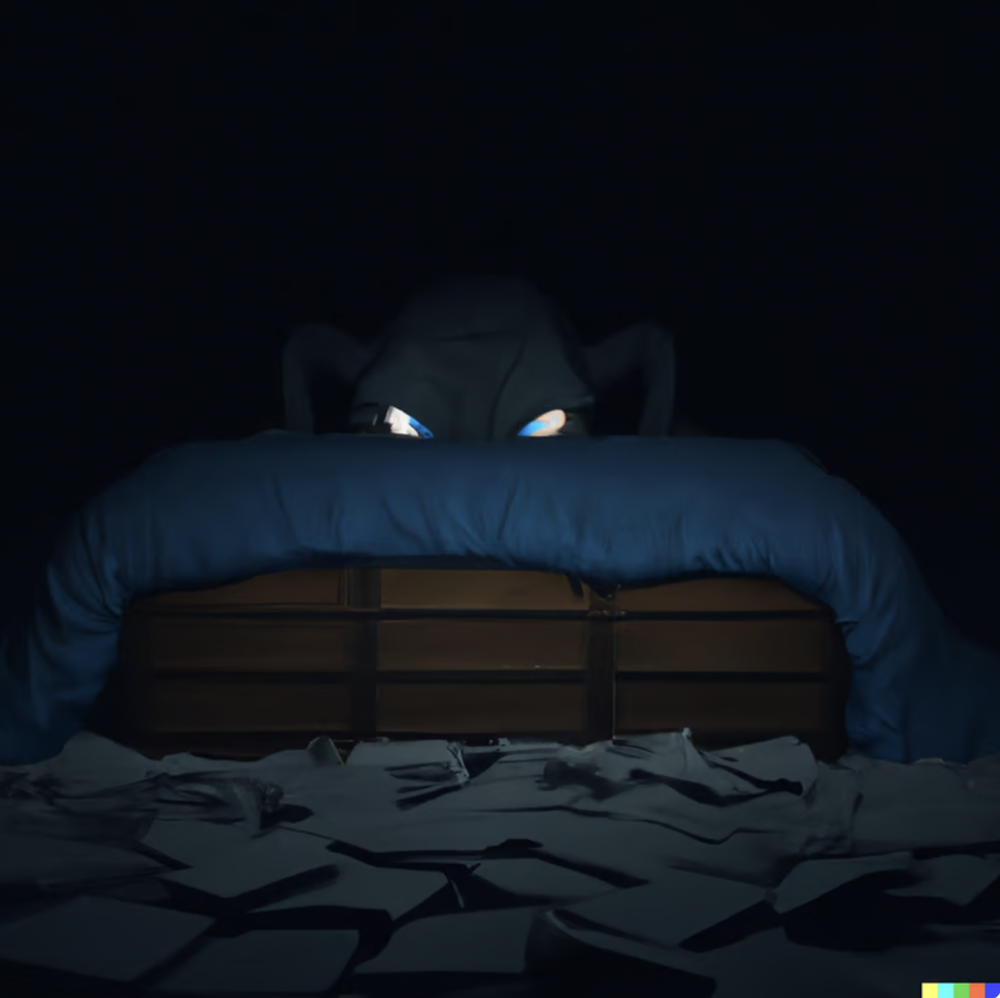
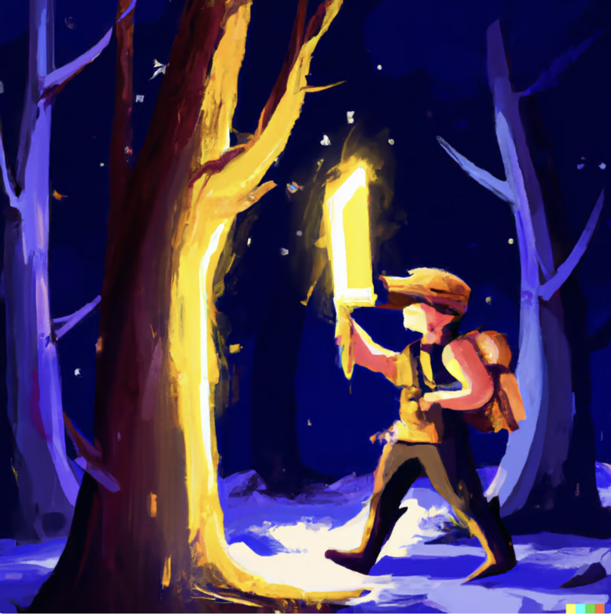

_DALLE: person on a empty staircase in a dark room_

Trust

The definition on the web is "firm belief in the reliability, truth, ability, or strength of someone or something."

Trust is something we all grow up with. We learn to trust our first time learning to walk. We learn to trust our ability to read. We learn to trust our ability to read

But trust is not just internal. It can be external too

We build trust with those closest in our lives. The parental figures, the friends, the communities we grew up around

However trust is fickle.

Just as trust can be gained, it can be lost. 

This could be losing someone significant in your life. Excommunication from a close community. Betrayed of all expectations in your worldview by making yourself too vulnerable. Suffering a long lasting or permanent injury. Fired from a job when you least expected it. Perhaps all of these in one shot

Sometimes life can be really traumatizing. It can be hard to forgive. To move on. To not be retriggered by things that affect you so negatively, when those triggers might be so incredibly common

When things hit such a low phase, it feels like you can't trust anything. You don't know right vs wrong. Your mental state is broken.

You don't know what to believe in. You spent your life believing one thing only for it to be shattered instantly. Everything that comes at you feels like an attack. You automatically assume every worst case scenario, because it happened when you least expected it. 

You were naiive in your worldview. And it caught you with your pants down. And you paid the ultimate price for it

How do you go back from this?

It starts by trusting yourself. There are many ways to build trust. It starts with you. These are exercises to take, in building trust of yourself internally

_the guardian: alex hammond freestyling climbing_

## Facing your fears

Everyone has weaknesses and fears. Someone who doesn't, doesn't know what it means to feel and relate to others.

Fears come in many forms. To conquer and regain trust of self, it all starts by tackling the fears in your life

First it comes in putting yourself in situations that force you to confront the fear. By putting yourself in those situations frequently, you are regaining the lost trust triggered by the fear

Perhaps you have a fear of heights, because you fell two stories off a ladder. Learning to climb and embrace the fear gives you a core sense of confidence

Perhaps you have a fear of social rejection, because you grew up getting bullied and humiliated all the time. Learning to dance forces you to deal with social rejection frequently. And accepting it's okay not being liked

Perhaps you have a fear of being controlling, because you grew up in a controlling household. Learning to sit and do absolutely nothing, or meditating is one way to let go 

Perhaps you have a fear of being controlled, because your trust was always violated and you didn't develop a strong [sense of self](https://www.vincentntang.com/maintaining-a-sense-of-self/). Learn to love yourself first, and don't compromise on your needs

Perhaps you have a fear of going totally broke, living on the streets - because it happened to you in childhood. You spend everyday thinking short term with money, and feel the mountain of burden daily. Learn to offload these thoughts with budgeting apps - and invest in your career skills

Perhaps you have a fear of being logically wrong, because your parental figures told you so and you accepted it for far too long. Critical thinking becomes hard. Learn to challenge the status quo and develop your own original thinking

Perhaps you have a fear of failure, because you were punished when it happened. You develop a high stress anytime when something is on the line - learn to be okay with being mediocre

Perhaps you have a fear of repeating past mistakes, because it feels like you regress backwards. Learn to accept it's okay for mistakes to happen, we're all human - just don't be blindsided by it

Perhaps you have a fear of the unknown, the most common fear. Travel to a new country, try new foods, go hiking and camping, embrace the sense of adventure that comes from the unknowns. Things aren't as dangerous as the news might make it out to be

_DALLE : monster under the bed, dark theme_

But sometimes the fears go much deeper. Sometimes it goes into a level that paralyzes you entirely when you think of that past event. Sometimes it brings a well of emotions when you think of it, and you don't know know how to handle it

This goes into a massive level of trauma, in the realm of complex-PTSD or PTSD (post traumatic stress disorder) 

To fix this, you have to talk to a therapist. To understanding the issues, properly labeling them, and preparing a plan so you aren't caught with your pants down next time

It means having to be your own therapist on top of having one. It means joining a support group if you can't afford one. It means picking up a lot of self-help books, journalling, and really understanding where the issues and faults that lead to this situation to begin with

There are things you can control - such as where you put yourself in a situation. Don't waste time thinking about what can't be controlled. Only relive the past long enough so you can process the emotions and peacefully move on.

Don't beat yourself up either. It is not your fault. You didn't know any better at the time, you were naiive in your worldview. 

_DALLE - going on an adventure, digital_

## Force yourself in new, uncomfortable situations

These aren't specific to any fears. One way to get over something is by creating new memorable experiences to override old ones

If you lose a significant other, this means overriding old experiences with new ones. Going on solo adventures. Doing things you used to do, by yourself

If you lose a sense of trusting your thoughts, you have to force yourself in places where you are forced to trust yourself. Plan half your travels and figure the rest along the way

If you lose a sense of community, you have to learn to open up and make friends again. This means you have to be vulnerable. Learn not to overshare, learn to feel who is trustworthy, and that will give you a sense of deep-intuned freedom. Don't waste time on social media

You can't go back to the old naiive way of things. You've seen the other side. This means you have to be stronger. Mentally, physically, emotionally. 

This might mean you have to develop more skills in soft-sciences - sociology, psychology, antropology, etc - because this is part of the plan you need to prevent the same situations again

## Throw away old stimulus's

If your triggers are close to home, you need to leave them entirely. It could be a city which you live in, that is constantly igniting all the triggers

You can't heal as a result. This means the fastest way to heal is selling everything, packing up, and move. 

Sometimes you simply can't do this. You can still live in a city, as if you didn't live there. Throw out all the old places you used to go to, move your furniture around, and throw yourself in a completely new set of circles instead

Learn to [embrace change](https://www.vincentntang.com/embracing-change/) for what it is, and don't look back

_frontier - robot arm doing spinal surgery_

## Retrain your nervous system and reactions

The body absorbs a lot of emotions. It comes from the social conditioning we grew up with.

Sometimes you will have a naturally reaction that doesn't play in your favor. Perhaps your parents were too people pleasing, and now you inadvertenly do as well. Perhaps they were oversharing, and now you inadventently overshare to your detriment

You have to learn to retrain your nervous system. Your nervous system will have a gut reaction, tell it no. Tell it it can go shove off, and everytime you do it you retrain it to exactly what you want it to be. 

At some point, you are no longer bound by the social conditioning and cultures you grew up with. You become evolved. You learned to just take the best parts of the cultures and identities you grew up with, and discard the rest

## Moving on

Life threw you a massive curveball. You didn't expect it. It caught you when you were most vulnerable, and now it's caused some level of trauma. 

Only you, can fix you. You need a plan. But you don't need endless levels of therapy. Just enough to understand, to be able to label the things that caused the problems to begin with. 

And you have to conquer those fears everyday. Those fears that make you scared of the unknown. You have to tell all those reactions you don't want to have, for it to go f*ck itself. You have to [let go](https://www.vincentntang.com/letting-go-and-solar-eclipses/)

That's how you live through the everyday

That's how you learn to trust yourself 

That's how you be you
