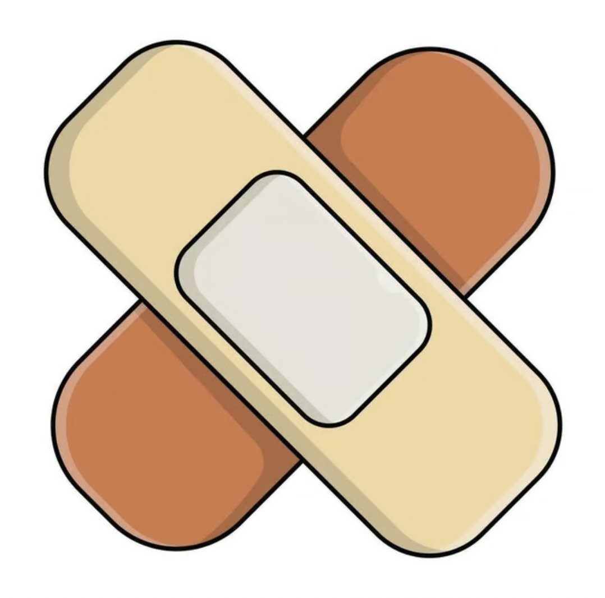

In life, there are times where we feel wronged by something that has happened to us. 

It could be something targeted. Or something completely random. In either case, a sense of confusion ensues, and we're not entirely sure what to make of the situation

If this is something that occurs on a semi-frequent basis, your perception of reality warps to assume the worst. Because in your worldview, negative things happen a little too frequently. 

This could be due in part to the burdens of responsibility you carry. You are constantly exposed to negativity, because you are constantly responsible for protecting something greater than your values, or your belief systems. This could be from a job - from family - from friends, from a host of different things

If you had to carry an invisible backpack of burden your entire life - it can feel hard to relate to others. Sometimes you feel that you are not understood. 

You might feel that nobody could possibly relate to your problems. And that very well may be true. But it's important to understand that you are living just one worldview, one slice of life - and it's important to see the other side

It's important to see the side of compassion. The side of giving in lieu of all the bad things happening around us. 

It's important to be compassionate to yourself. To be able to see these old wounds you carry, the ones that hardened your resolve growing up. Those wounds which makes us assume the worst in a given context or situation, because we've seen the worst in others too many times

We don't have to give into the negativity despite it's frequency. You can choose to see things from a different lens - one that is altruistic as well

It's important to not see life through one particular lens. Seeing too much good - can make you naiive and vulnerable. Seeing too much bad - can make it feels like the world is out to get you

Finding a balance; a middle ground is important.

But you have to be exposed to both worlds. 

Ultimately, it's best to be compassionate first. You can assume a baseline in the best of others; we're all people. But there are times when you have to be aggressive when a situation demands it

This is especially true in business settings. It can be brutal. There is a clear objective, and sometimes their gain is your loss, and there's not really any other way to interpret it. You have to be strong in protecting your interests first, and be compassionate to yourself first and foremost

This means being able to recognize the signs of aggression towards you. Whether out of desperation, or sheer bullying level aggression. The former requires compassion, the latter requires aggression to deal with. 

This means knowing when to walk away. When to stamp your footdown, and subverting the plan in motion. This means knowing how to politically deal with a difficult confrontation that you cannot always avoid.

In the end though, you should not let negative situations affect your overall perspective on life. Even if it happens frequently. Who you choose to be, is of your own accord, and if you see things through the lens of compassion first - good things usually follow suit

You are what you attract.

Don't hold onto old grudges.

Always be compassionate to yourself, then to others - as the situations permit. 

You can be compassionate to others without being trusting at the same time. They aren't one in the same. 
