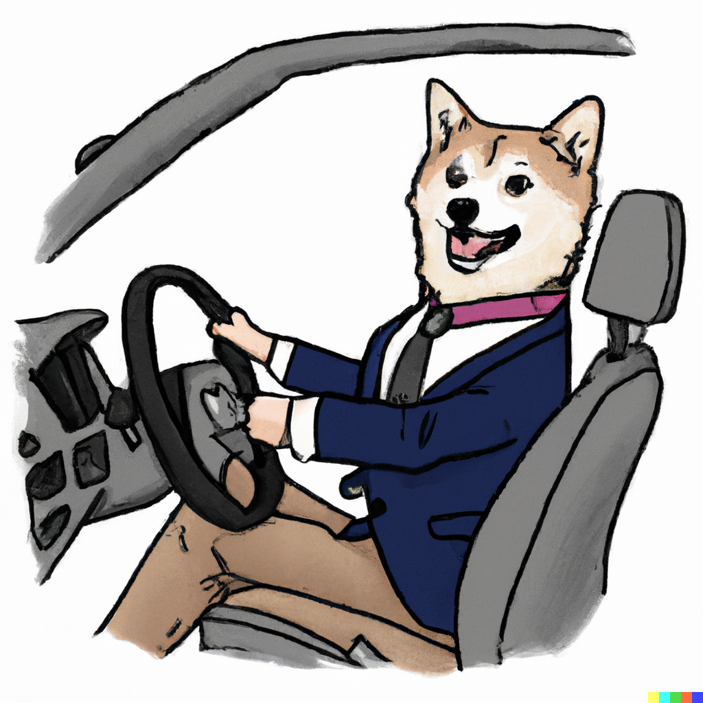
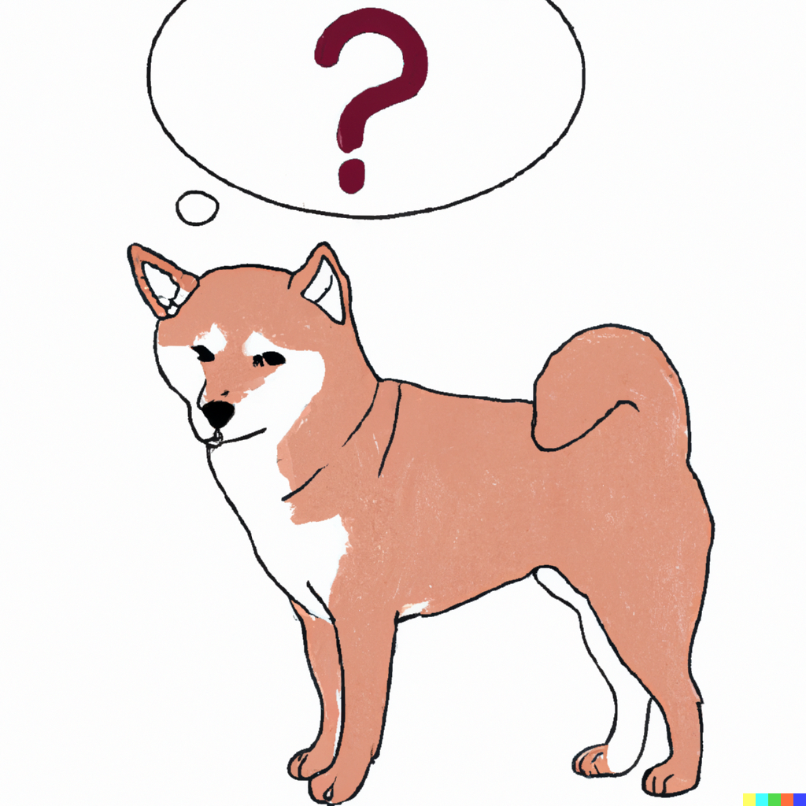
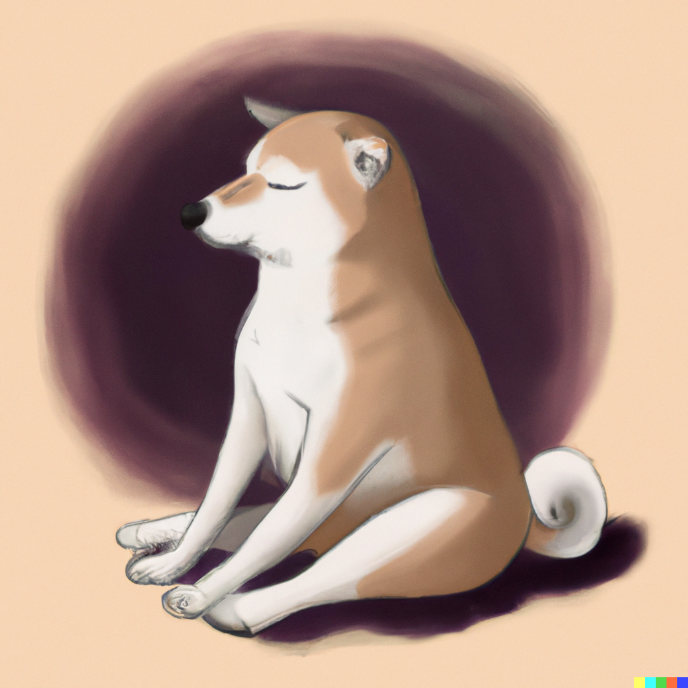

_DALLE - a a shiba inu dressed in a suit driving to his first day at work, digital_

Imagine this scenario:

You wake up. It's 9 am on a Monday. It's a nice sunny day outside. Your had a really good weekend to yourself among the close friends you hang out with. You take a shower, eat breakfast, read a bit of news, and then dress up to go drive to work.

You arrive at work. Your boss scheduled a 1:1 with you, it's your second month at your first ever job. You think you've been doing an awesome job, and don't really think much about this meeting

Walking into the room, your boss tells you to sit down. You sit down. He has a look of expression on his face that is not his usual expression, and you sense something not so great coming your way

"We have to let you go". You follow up "...what do you mean by that?". And he clarifies that you're fired. You follow up with "...why?" and all you get is a half baked corporate answer response. 

You are shocked walking out of the meeting. You are packing away your things now, your colleagues see the expression on your face and ask you "what's wrong?". You deal with it how you see fit, either with rage or walking out quietly

You pack your things and leave. Later you reflect on this. You spent 80 hours a week busting your ass at this job, because you really wanted to prove yourself. You lose a massive sense of self confidence, because you feel you weren't good enough. 

You don't think your ever going to get hired again, after being fired like this. You are confused, you don't know whether to be angry, sad, and everything just hits you all at once

This is a traumatic event to you. You've never been fired before, and this was your first ever job.

_DALLE - a shiba inu with a question mark thinking bubble, digital_

## What is trauma?

At some point in our lives, we go through trauma. Trauma through a series of complex events we can't explain or understand at the time of it

These events vary greatly in nature. 

They can be short lived in nature and unexpected, such as unexpecting getting fired from a job. Or it could be an unforseen car accident.

It can be longer lived,  such as those in messy breakups, childhood bullying, violence in wartimes, suffering in life altering medical conditions, etc.

In these events, there is always something that is lost along the way. It could be the loss of someone close to you. The loss of your beloved dog or cat. The loss of finances and lifestyle such as those in Covid. The loss of a limb or motor function. The loss of a prized possession that you own, such as a car, a family heirloom, etc

These losses, do not have to be physical either. It could be a loss of trust in ones self. In the case of an unforseen car accident, the loss of trust in your driving ability. Or the loss of trust in the drivers around you. Or both. It may also lead to the fear of repeating the same thing again, and fear of the unknown

Another example that is not physical, is the loss of innocence. You grew up with a set of expectations on how the world works, and things get flipped upside down. 

This could be the dream you had of changing the world with your startup, only to have to fire everyone later yourself. This could be the the dream of serving in the military, only to see the worst of it during training and wartimes. This could be your idea of romcom romance, until you experience the ugly side of toxicity in relationships. 

When these experiences happen, a sense of naiiveness in the world is lost. Trauma in part is both a combination of what we lose in both a physical sense, and a metaphysical sense. The ideologies, the dreams, the innocence, as well as the physical attachments we lose.

These experiences happen over a duration of time. Sometimes, we forsee the problem, sometimes we don't.

In the event of things unforseen, dealing with the shock of it all is the hardest. You lose trust in others. An example of this is getting fired at your first job, unexpectedly without reason or explaination. 

For events that we ourselves had to initiate - such as breaking up with someone - there is an aftermath of guilt. One in which we don't feel we deserve love, because we denied it elsewhere in someone else.

_DALLE - a shiba inu reading a book, digital_

## Overcoming trauma

Trauma varies a lot between different events. There is however, a set of conditions for the worst ones though

The most traumatic events to deal with are those over a long duration of time, with things completely outside of our control, unforseen, and against our strongest values.

This is especially true for those who have been through sexual abuse, especially if you are a compassionate person. Or those that have lived through war times either serving actively or as a bystandard, and have seen the worst of it

These take the longest to heal. Sometimes, we cut off all of our emotions entirely. We lose what it means to feel, because we experienced so many negative emotions with all of our senses. These are smell, touch, hear, sight, and taste.

In the aftermath of trauma such as these, we learn to put a strong front. We don't want the same mistakes to happen again, because we feel we are regressing backwards. 

Sometimes, you just have to be this way. If you are the sole breadwinner of the household, you don't want your family to go through living on the streets again. If you are the leader people look up to, you feel that you can't be lost and confused because it will affect everyone else. If you are the one people trust with problems, you can't be truly vulnerable with your own issues

At some point, you have to realize that you can't always have this strong front. It's okay being vulnerable, among those you can feel comfortable in confiding in and trusting. It provides a sense of emotional freedom - that you can let yourself run free.

It's okay to be angry, to be sad, to have shitty days. That's part of being human. Those emotions that are stored up in traumatic events - they have to be let out.

We fight the urge to do this when we have a strong front. Because we're in denial. Our brain denies that we are feeling sad, but there is an extremely tight tension in our body that says otherwise

You have to trust your subconcious gut in these cases. 

_DALLE - a shiba inu travelling the world, digital_

## Understanding environmental triggers

In the worst of traumatic experiences that we endure, we also have to recognize the triggers that have caused it. Going back through these events with a therapist, a trust friend, etc is vital. If finances are an issue, find a support group instead

When you understand the environmental triggers that have caused it, you can learn to be okay with trusting yourself and the world around you again. 

If something traumatic happened in a new city, you have to explore new cities. 

If something traumatic happened in a relationship, you have to create new relationships with others. 

If something traumatic happened with a certain type of aggressive person, you have to have a plan of action in handling that type of person again. 

If something traumatic happened in a specific environment such as a business, you have to go back to that environment again in other cities or countries

If something traumatic happened in a new culture you were exposed to, you have to expose yourself to new cultures through visiting other countries

If something traumatic happened in a job or occupation, such as if you are a surgeon or doctor, you have to tell yourself you did all you could

If something traumatic happened when you went broke, you have to learn to invest in your skillsets and financial planning

If something traumatic happened against a strong core value you had, you have to learn to put a higher wall up initially with people, places, things, etc

If something traumatic happened against a specific thing, such as a firearm, you have to get over the fear of one through training

If something traumatic happened based on a particular combination of sense - touch, smell, hearing, taste, sight - you have to recreate that experience again virtually or in reality

If something traumatic happened in a close community, you have to build and find yourself new communities 

If something traumatic happened in your family or extended family, you have to confront a hard situation and be willing to go all the way with it - and/or create family connections elsewhere in others

If something traumatic happened when you were swapping careers and no one believed in you, you have to pave the way forward for others going through the same struggles to get over it.

If something traumatic happened and you permanently lost a motor function or limb, you have to appreciate what you do have in life instead of comparing what you don't have. 

If something traumatic happened and you lost someone close to you, you have to learn to create that connection in someone else again. 

_DALLE - a shiba inu meditating, digital_

## Closing thoughts

These triggers can be very complex, depending on the number of triggers that are overlapping with each other. This is effectively what PTSD or c-PTSD is. Getting over that trauma, depends on a few different things. 

These include how willing you are able to embrace the trauma, and accept it for what it is - the good and the bad. 

It means you have to [trust yourself again](https://www.vincentntang.com/learning-to-trust-yourself-again/). It also means having to [let go](https://www.vincentntang.com/letting-go-and-solar-eclipses/) of other things in your life in pursuit of overcoming it. It means you have to embrace those fears through [uncomfortable situations](https://www.vincentntang.com/how-to-deal-with-uncomfortable-situations/). It means you have to use [forge a new path](https://www.vincentntang.com/forging-your-own-path/) to force yourself into [the change](https://www.vincentntang.com/embracing-change/) you want to be.

It means you have to [learn without boundaries](https://www.vincentntang.com/learn-without-boundaries/), in the sense of exploring inwardly on yourself. To be able to see develop a sense of mastery of your own problems and own shortcomings

You have to be [compassionate to yourself](https://www.vincentntang.com/compassion-healing-old-wounds/) first and foremost. You have to develop a set of inner discipline, establish a set of principles for yourself, in order to overcome these things over time
