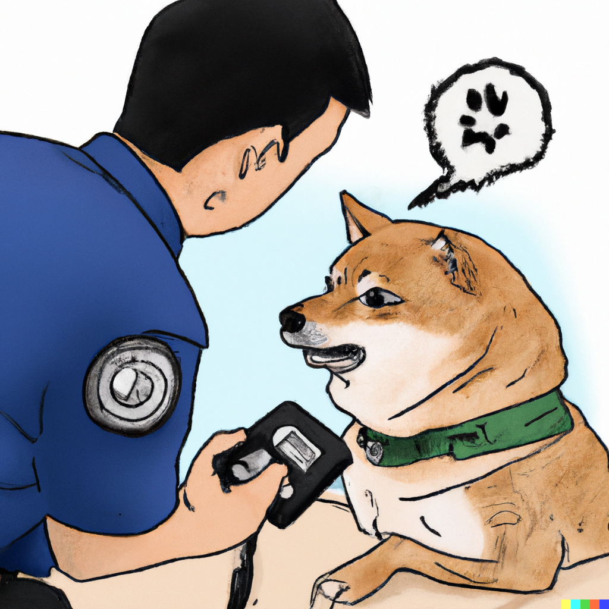
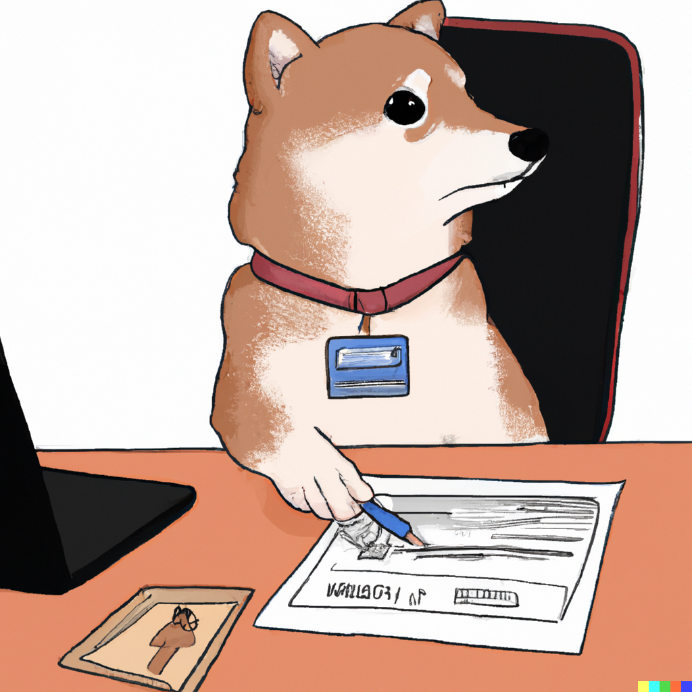
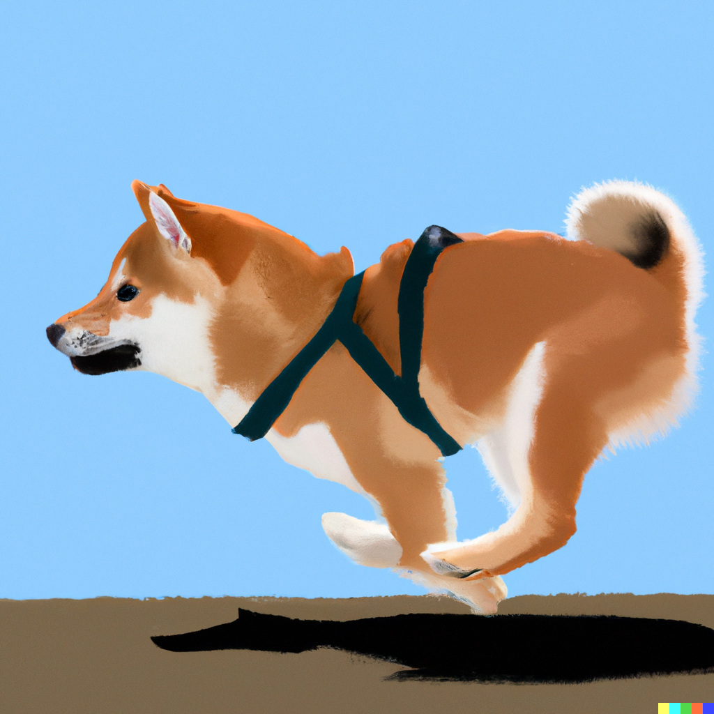
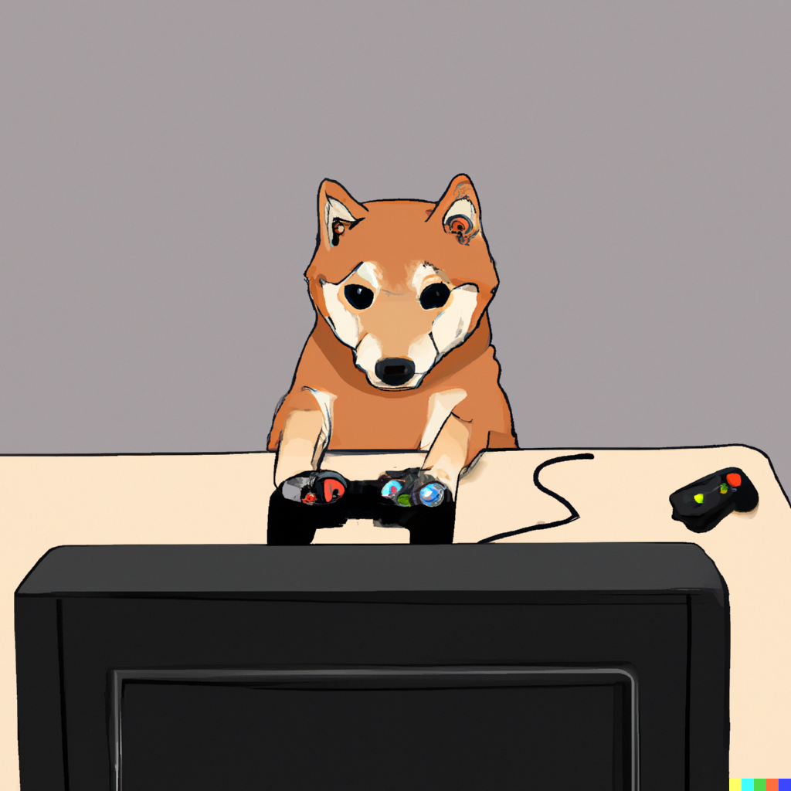
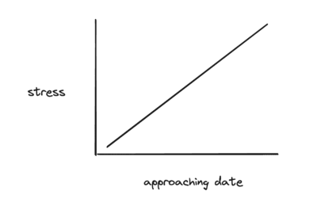
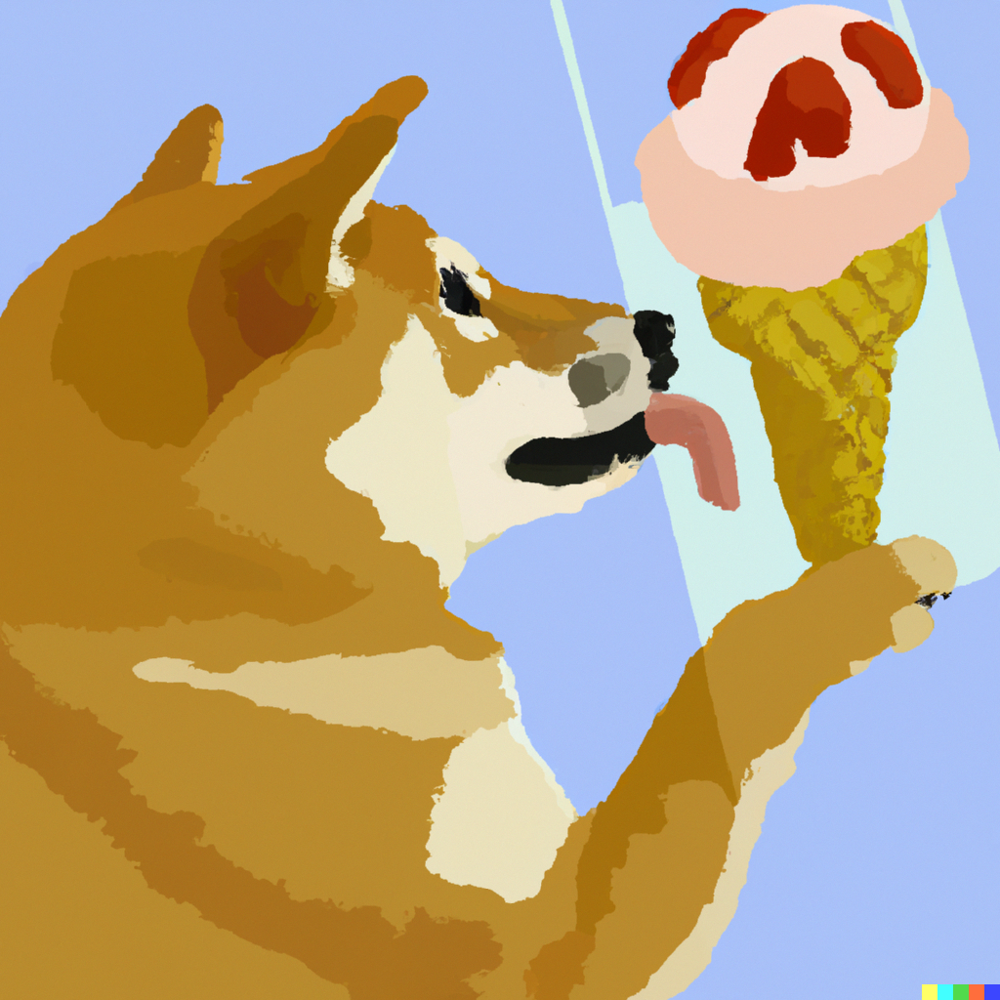

_DALLE - an FBI shiba inu negotiating a hostage situation, digital_ 

Hostage negotiators. 

It is one of the few profession that deals with high stake, high stress situations often. They are responsible for de-escalating a situation, and ensuring everyone gets out of a situation unscathed. 

The measure of their success is dependent on how well they can analyze, create a plan, and socially confront a difficult situation. They have years of training to hone their craft, so they can arrive at the best available outcome possible

They are the best at what they do. And there is something we can learn from their craft.

But most of us will never be a hostage negotiator or aspire to be one. We don't deal with high stress high stake situations at this level where lives are at risk

But, we do deal with something similar to these in our own lives. They are of a different context though, where the stakes might be a potential job or a relationship.

These are still high stake, high stress situations in our worldview. The outcome changes what the future holds, and we don't always have control of the situation either

So how do we handle these situations?

_DALLE - a shiba inu applying to jobs for the first time, digital_

## Context scenario

Just imagine this scenario

You are applying for jobs for the very first time in your life. In a career that you spent years studying for. You toss in what feels like hundreds of job application

You have a ticking timeline. You need to find a job to pay the bills, the rent, and possibly a dependent who relies on you. You are desperate. 

Nobody bites on your job applications. There is no response. The job market also sucks too as it's in a downturn. You feel dejected because there is no sign that things will get better for you. 

You've done what feels like everything you can in your control to improve the situation. The job though, is outside your direct control

You know with enough time, patience, and resolve you will find a job. It is a matter of improving your resume, doing mock interviews, and leveling up your skillset.

Eventually you get a call. It's from your dream company! They want to do a technical interview. It's a week from now, and you have never done an actual interview before. You are also socially awkward too, so this makes things even harder

You are stressed out about this ordeal. 

The stakes are high

How do you deal with it?

You have to acknowledge first and foremost, that this is a stressful situation.

From now, to the event - you have to create a plan of action. A plan of action helps alleviate the tension caused by the shock of news. It also helps alleviate the fight response in your brain into something more actionable. 

When it comes to an action plan, it's usually best to think in terms of 3. There are 3 phases to chunk it into
 
- Now (day 1 upon hearing the news) - dealing with the shock and stress accumulated 
- Middle (day 2-5) - the preparation work for the interview
- End (day 6-7) - the day before the interview, and the day of the interview

_DALLE - a shiba inu going for a run, digital_

## now phase

The "now" phase is really acknowledging the stress of the entire situation.

You have to look at yourself in a third party light. Imagine someone close to you going through this scenario, how would you react to what they ar going through?

You might probably tell them, that everything will be okay. That you spent 4 years honing these skills and this knowledge, remember all those hard exams you've done before? That discipline, that practice, it will come when you most need it.

You might also tell them, that you can help them out if needed. To do mock interviews, for any advice they might need as you've done this before, etc.

This is also a point where you decide who you want to alleviate the burden of this responsibility too. Someone else has been through this before, and it's a matter of knowing who to confide in.

You don't necessarily want to confide in your classmate who is also getting an interview at this same job. There is only job opening here. And he/she is your rival in this context, and doesn't have your best interests at heart. Perhaps someone outside your major instead, such as a family member or close friend

In the event you don't have a support network like this - because you are socially awkward, you have to do this anonymously and into the void. You can lurk on reddit, post advice seeking for help, taking an uber and talking about the issue, or talking to some random person at your DnD event your going to that night. You can also just talk to your dog or cat, or if your a programmer you can do [rubber duckying](https://en.wikipedia.org/wiki/Rubber_duck_debugging)

Asides alleviating the burden to those you can, you have stress accumulated in your body. You need an outlet to express it, to help alleviate it. Perhaps journalling, or blogging if that is your thing. This helps clear out the emotional and mental stress accumulated, but there is still physical stress stored as well.

In cases like these, going for a run is one quick way to alleviate the tension and shock of it all. It gives you a sense of freedom and control from this situation you cannot control. It also converts that fight response from your muscles, into another area - the pavement on the ground

_DALLE - a shiba inu studying and reading books, digital_

## Middle phase

The middle phase is the largest chunk of time usually. 

It is the day after you've slept and dealt with the "now" phase. The sooner you can get it over with, the faster you can prepare during the middle phase

The middle phase is simply asking yourself if you need to do anything in preparation for this. Sometimes the answer is no, but if you are stressed out, the answer is yes.

You've never been in this situation before. Or maybe you have, but something very similar that is relatable

If you have been through this before, try to remember how you handled a similar situation. Perhaps, you have applied to a volunteer role before, when you needed volunteer hours for a scholarship.

What did you do? What things went well? And what things went poorly that you could you have improved upon?

Sit down, and remember it. Bring that event back to life, look at old photos if you have them, journals, etc. Look up the place where you volunteered otherwise

Do this everyday leading up to it. You are instilling a mental state of practice leading up to the event. It is creating a sense of resolve for you, a sense of confidence.

Asides this, you will also want to emulate the environment you will be in for the interview. Doing mock interviews online helps out, and asking those you confide in as well

Whenever you are also eliciting a stress response to this interview - remember you have a plan of action. 

Sometimes this plan also includes some [power paradigms](https://www.vincentntang.com/forging-your-own-path/), like "I got this" or "I will think about this X date from now" and marking a calendar point where you think about it instead

At some point you have to do other things and can't be thinking about this interview 24/7. Go put yourself into a fawning state and reward yourself after doing the practice you need. Perhaps it's going out to your favorite food/restaurant, playing video games, watching that movie you always want to see

_DALLE - a shiba inu playing video games, digital_

## End phase

The last phase is usually when your stress levels peak up again. It is natural. The timeline is ticking and you know it is coming up

You are anxious. You want to get this interview over as fast as possible, and move on with your life. You've already practiced as much as you can leading up to this point

In the day before the interview, it is stressful. 

Think of it like an exam. You've done many of those before, how did you handle them in the past?

Reflecting again, you've probably realized studying right before an exam is a waste of time and energy. It can be represented in this diagram

You'll want to conserve that fighting energy, for the interview itself. Don't exhaust it. Put your mental state into a state of fawning instead

This means, going out and having fun! This means playing that video game you always want to play. This means going out and hanging out with friends - and not talking about the interview tomorrow. This means, listening to your gut in what you want to sponatenously do in the moment

You have to practice being present, being sponatenous now. Because on the day of the interview, what will help you the most is trusting your gut, and your spontaenity. It is not rehreasing the same mock interview for the thousandth time, there is actually a point of depreciating return in which things become too rehearsed

This whole thought process is paradoxical in nature. You are effectively taking out your brains natural instinct of worrying, and not giving a sh*t instead. You spent so much time caring about this whole ordeal, it's time you stopped caring about it.

It becomes a middle ground in your mind, a sense of security. That you are okay with things burning to the ground and willing to fail at the interview. You have no expectations now. This is what you are telling your brain, and swapping to this mentality inversely means there is a greater chance of success at the interview

_DALLE - a shiba inu eating ice cream reflecting, digital_

## Closing thoughts

This whole interview is just an analogy to life in general. We deal with high stake situations every so often in life. They are hard, they are stressful

They vary greatly in nature

It could be initiating a breakup for the first time in your life. It could be confronting a hard situation with a close friend, and renegotiating the friendship. It could be giving a morale speech to an audience with hundreds of people who will suck down every word you say to the tee, and think about it in the coming years. It could be firing someone for the first time in your life at a company you work for or own. It could be expressing yourself freely in public writing and not giving a sh*t what people might think of you

It could be so many things. High stakes, high stress situations are part of life. They are the ones we look fondly past once we overcome them

Just remember to relax. Breathe. Everything is going to be okay. It's just you working against you; you are your worst enemy. Create a plan of action instead that you can alleviate the responsibility. Think of it as your second brain

You got this
