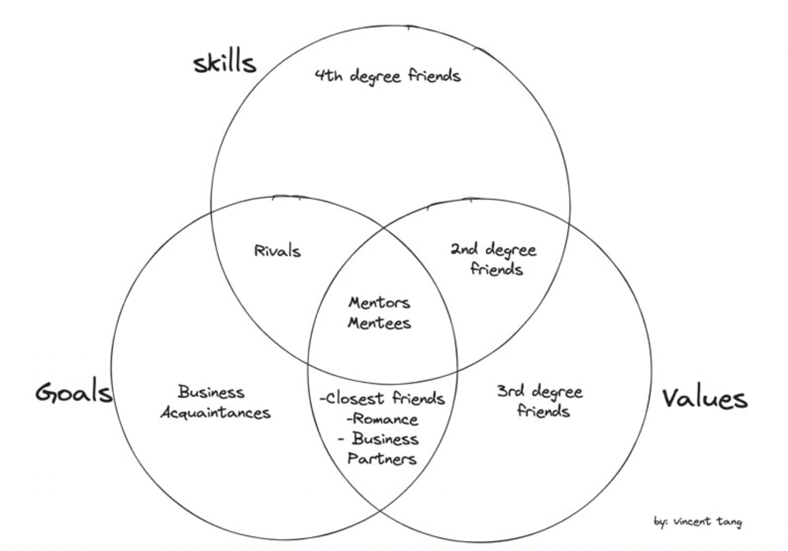

Relationships are complex.

It is a bond formed from one person, to another emotionally, physically, and mentally.

It can come in the form of friendships. It can come in the form of mentors. It can come in the form of a significant other. It come in the form of business partners

There are so many types of people we run into our lives. 

It's sometimes hard to make sense of it all. Who plays what role in our life? How do we go about making friends as an adult, or kid? What if we, or someone else undergoes change - what happens to the original defined relationship?

At some point, we will form some strong relationships. Sometimes, they stay strong. Othertimes, they don't sustain and wither away. Sometimes it's hard to wonder why things didn't work out in the end - whether it's a friendship, romance, business, mentorship, etc. It could be so many things

There are a number of ways to boil this down though. But a simple concept is using a system of 3 criteria - values, skills, and goals, deriving from [why less is more](https://www.vincentntang.com/why-less-is-more/)

Here's the diagram 

Values come from ideological belief systems. It usually stems from some combination of cultural influence, the degree of religion influence, family influence, and socioeconomic upbringing.

Skills is mostly around what someone likes likes doing (and is usually good at) to feel a sense of importance. Perhaps, it is drawing - it gives you free reign to express yourself. For others it may be leading a group - sharing wisdom to others - it gives you a sense of purpose and empowerment. For another person - it might dominating someone else at pickleball or a sport. For others - it might be breaking down a mechanical system and the feeling of power using it, such as a motorcycle

Goals are long term goals. Think of these as what excites you, what do you want to create? What 5 year plan do you have?

If you are looking for someone to settle down with - do they have the same goals in marriage, kids etc? If you form a business partnership, what are their thoughts on how money is handled? If you form a friendship, what goals do they have either career, living prospects, traveling, etc?

## Breakdown of categories

### Values

People who fit in this category, share the same values you do in life.

Here's an example:

If you are a down to earth, chill person, you'll also get along with people who are also equally the same. You both value peace and tranquility, and you are okay just taking a backseat

If you are a hustler, you will not get along with someone like this. You might think they are lazy. Instead, your preference is with people are leading others - or proving themselves publically with all the things they are accomplishing. You are competitive and want to be in the spotlight

If you are someone that needs to prove themselves when you are young, you will also meet others who also want to prove themselves

If you are older or have lived a lot of life experiences, you value more time in reflection. You will get along with people who also value reflection based activities like going for a walk or doing a casual bike ride

If you are of a specific religion, you will get along with people of that same religion because you share the same top level beliefs

The type of person you will meet in this standalone category is what is considered a 3rd degree friend

This is someone you would occasionally talk to either out of convenience, or in a local friend group. You probably won't make time to hang out with them 1:1 (and neither will they), but everytime you see them you might say hi and catch up out of convenience. 

This person you will hear about life updates from your closest friends + 2nd degree friends, or on social media

These values are not completely binary. Think of these as weighted criteria - a person has many values, but some values are more important to you than other values. 

You can just rate on a scale of 1-10 how well you think your values are compatible with the person you are thinking about overall

### Skills

People who fit in this category, usually share the same hobbies as you do, but not necessarily for the same reasons you do. I will get into more in a bit

Think of these hobbies as anything from writing, book clubs, skating, climbing, dancing, etc.

You will meet people in this circle that you might say hi to, be in a group chat - but never really develop any real depth of conversation. Because you might have nothing in common besides the hobby itself

These are what are considered 4th degree friends. People you may hear about from your 3rd degree friends, but probably not your closest or 2nd degree friends.

You will see them. Maybe even date them before you realize there's nothing substantial long term. Maybe say hi. That's really about it, you can think of them as acquaintances

### Goals

People who fit in this category are those based on some specific timeline

This timeline could be working out at the gym on a 3 month workout plan. Or going on a diet through the year. Or working on a cybersecurity certification, or some sort of higher level learning or education. Or people in University in the same major

These are people who share some similar type of goal as you do. They share the same struggles. They are going through the same life motions to a degree.

Those that fit just in this circle, are business acquaintances. 

If you actually run a business, these would be your clients, your sponsors, custom service representatives, your employees, your boss, etc. People that you do business with. Exchange of service, you need a specific need, and they need one as well

### Skills + Goals

People who fit in, are generally those you think of as rivals

They are working towards the same things as you. They possess the same skills at executing that goal as you do.

Think of this as a gym buddy. You can motivate each other in this sense, because your goals are towards yourselves. You might not really have anything in common to talk about though besides the workout routines

When the goals are externalized though, this becomes a form of competition. There is only one first place, and only one person can get it. This could be a job or promotion at a company. You have to protect your own interests first in these cases 

### Skills + Values

These are your 2nd degree friends. These are the friends you first make when you join a new hobby - they might not share the same goals as you, but you just get along with them

This is the chill rollerskaters you hang out with. This is the climbers you see often and have cooler chats with, and see that you come from the same culture or like similar hobbies like video games.

These are the people you end up becoming friends with. You invite them to parties, they invite you. You find them to be a close connection - a community of sorts. Sometimes a group chat is made and it includes a lot of these people that you get along with there

You'll say hi to them. You'll get to know them, either directly, or indirectly. In any case, this is a pretty good circle of friends

### Values + Goals

When you meet someone who shares the same values and goals, but not the same skills, these are the ideal people in your life

This is the closest friends you have. The ideal person you should be dating if you are not already. The ideal business partner to form a business with

For a business partner, you share the same vision - and the same values and goals to get there. The execution may be different - because your worldviews are different, and one person's worldview has to override the other. Some tough decisions will be made especially when things scale and finances are involved, but that's normal

For a close friend - you have the same long term goals. You both have higher learning interests for instance, and both believe in keeping things easy going as an example. You both vent about problems the same way and deal with similar issues. You both might also have the same long term goals in starting families - but aren't compatible in a romantic sense

For a significant other - you believe in the same views on marriage and kids. You both share some similar ideological beliefs - and this is what makes getting along easy. You could come from different cultures, but those cultures could be similar based on the city and country as many cultures overlap. Because your skills are different, you aren't competing for the feeling of importance in the same way, and you can have interesting conversations as just friends too

### Values + Goals + Skills

Someone who meets all three of these, are usually parental figures. Because we take after a lot of values, goals, and skills from our parents, or the adopted parental figure we chose instead

In any case, these are mentors. These are people that will teach you new things, as they've lived life experiences you haven't yet. They are of the same personality type generally on the [Myers Brigg Spectrum](https://www.16personalities.com/), and have much to teach you

They can also be mentees, at the same time as being mentors. You can have a joint relationship this way, where it's give and take - you support one another as mentor/mentee in different fields

Eventually, this phase may come to pass where you no longer become mentor/mentees, because the mentee has surpassed the mentor. In this case, the relationship ends, and normally in this case it moves to one of the following

- a 4th degree friend - because you ended up changing your values along the way, and your goals are no longer aligned
- a 2nd degree friend - because there still cool to hang out with and get a beer, but you have no goals in common
- a rival - because you left the company and started your own thing, your values are different now but your both trying to build a company

In the form of romantic relationships, this is usually your first intense relationship. You both can't say no to each other. You both learn a lot along the way, but you realize you both have the same strong personality and the same way of feeling the need for importance. At some point along the way, things end. In the aftermath, there may be a friendship - as one person wants to stay as friends in hopes the other's values changes in the future, but the other person rarely ever change their value systems. Usually what happens is you both go seperate ways and move on with life, and have some keepsakes and memories you hold onto

In the form of family relationships, you grow up from your parental figures and do your own thing. You no longer need to be coddled and can handle the world on your own, in this case your skills and values are aligned, but not needing the same goals of getting/receiving support. 

_here's that diagram again_

## Closing thoughts

Your values, goals, and skills will change over time.

As you go through more phases in life, you will know what you like, and don't like. What your good at, and not good at. These are your skills. Time will tell for you. 

You will also have goal changes over the years. Perhaps you thought you were meant to be a scientist, but ended up doing construction, and now software development. But then you realize you actually just like writing things and code happens to be one of those cases. You might realize your passions are elsewhere in a completely different industry, but you don't have the means to get there just yet

You will have values that change over time. These happen during large life events, like getting your first job, getting fired, dealing with heartbreak, [trauma](https://www.vincentntang.com/understanding-what-trauma-is/), moving cities, being a digital nomad, loss of life in family/friends/pets, etc. There could be a lot of values that evolve over time, and your belief systems may change.

Along the way, you will also realize that everyone around you is also changing too. They will shift in this diagram. And that's okay

Some people are just there for certain times of your life. They taught you something valuable, if you took the time to process it. Sometimes you might take some part of their essence into your own personality, habits or music tastes. You leveled up thanks to this. There is nothing wrong with that, and you can cherish those memories for what they were. 

Life is full of change. Sometimes its good to [be the change you want to be](https://www.vincentntang.com/embracing-change/)

Sometimes, you just need to also [forge your own path](https://www.vincentntang.com/forging-your-own-path/) as well

At the end of day it's important to know [who you are](https://www.vincentntang.com/maintaining-a-sense-of-self/) and to realize it's the [journey not the destination](https://www.vincentntang.com/journey-not-destination/) that matters
